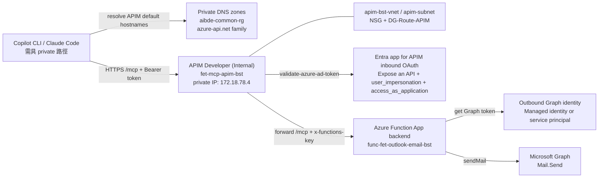
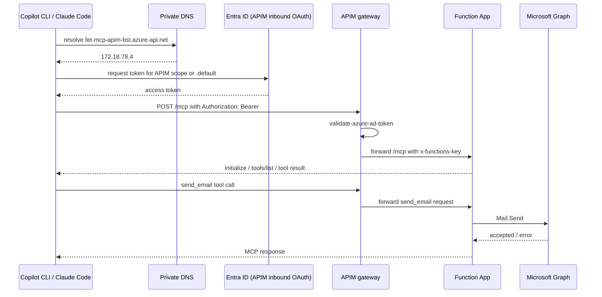

# MCP 伺服器：Outlook Email

這是一個透過 Outlook 傳送電子郵件的 MCP 伺服器，並涵蓋 **認證** 情境。

## 安裝

[](https://vscode.dev/redirect?url=vscode%3Amcp%2Finstall%3F%7B%22name%22%3A%22outlook-email%22%2C%22gallery%22%3Afalse%2C%22command%22%3A%22docker%22%2C%22args%22%3A%5B%22run%22%2C%22-i%22%2C%22--rm%22%2C%22ghcr.io%2Fmicrosoft%2Fmcp-dotnet-samples%2Foutlook-email%3Alatest%22%5D%7D) [](https://insiders.vscode.dev/redirect?url=vscode-insiders%3Amcp%2Finstall%3F%7B%22name%22%3A%22outlook-email%22%2C%22gallery%22%3Afalse%2C%22command%22%3A%22docker%22%2C%22args%22%3A%5B%22run%22%2C%22-i%22%2C%22--rm%22%2C%22ghcr.io%2Fmicrosoft%2Fmcp-dotnet-samples%2Foutlook-email%3Alatest%22%5D%7D) [](https://aka.ms/vs/mcp-install?%7B%22name%22%3A%22outlook-email%22%2C%22gallery%22%3Afalse%2C%22command%22%3A%22docker%22%2C%22args%22%3A%5B%22run%22%2C%22-i%22%2C%22--rm%22%2C%22ghcr.io%2Fmicrosoft%2Fmcp-dotnet-samples%2Foutlook-email%3Alatest%22%5D%7D)

## 先決條件

- [.NET 10 SDK](https://dotnet.microsoft.com/download/dotnet/10.0)
- [Visual Studio Code](https://code.visualstudio.com/)，並安裝
  - [C# Dev Kit](https://marketplace.visualstudio.com/items/?itemName=ms-dotnettools.csdevkit) 擴充功能
- [Azure CLI](https://learn.microsoft.com/cli/azure/install-azure-cli)
- [Azure Developer CLI](https://learn.microsoft.com/azure/developer/azure-developer-cli/install-azd)
- [Docker Desktop](https://docs.docker.com/get-started/get-docker/)

## 內容包含

- Outlook Email MCP 伺服器可在下列情境中執行：
  - 作為遠端 MCP 伺服器，透過 Azure API Management 使用 **OAuth authentication**
  - 作為遠端 MCP 伺服器，透過 Azure Functions 使用 **API key authentication**
  - 作為本機執行的 MCP 伺服器，不額外啟用 MCP transport 認證
- Outlook Email MCP 伺服器包含以下內容：

  | 組成元件 | 名稱 | 說明 | 用法 |
  |----------|------|------|------|
  | Tools | `send_email` | 將電子郵件寄送給收件者，並可選擇加入 reply-to 位址與附件。 | `#send_email` |

`send_email` 也接受選用的 `attachments`。每個附件項目應包含：

- `name`：電子郵件中顯示的檔名
- `contentType`：MIME 類型，例如 `application/pdf`
- `contentBytesBase64`：以 Base64 編碼的檔案內容

目前支援一般檔案附件，因此 **CSV** 與 **XLSX** 都可直接使用，只要提供正確的 MIME 類型：

- `text/csv`
- `application/vnd.openxmlformats-officedocument.spreadsheetml.sheet`

預設限制如下：

- 最多 **10** 個附件
- 每個附件最大 **3 MiB**

若需要更大的附件，必須另外實作大型附件上傳流程；目前 `send_email` 不包含 upload session。

範例：

```json
{
  "attachments": [
    {
      "name": "hello.txt",
      "contentType": "text/plain",
      "contentBytesBase64": "SGVsbG8sIHdvcmxkIQ=="
    }
  ]
}
```

完整 payload 範例：

```json
{
  "title": "本週報表",
  "body": "請參考附件。",
  "sender": "shared-mailbox@contoso.com",
  "recipients": "alice@contoso.com; bob@contoso.com",
  "replyTo": "owner@contoso.com",
  "attachments": [
    {
      "name": "report.csv",
      "contentType": "text/csv",
      "contentBytesBase64": "YSxiLGMKMSwyLDMK"
    },
    {
      "name": "report.xlsx",
      "contentType": "application/vnd.openxmlformats-officedocument.spreadsheetml.sheet",
      "contentBytesBase64": "UEsDBBQAAAAIAAA..."
    }
  ]
}
```

> 若有設定 `AllowedSenders`，`sender` 必須位於允許清單中。若有設定 `AllowedReplyTo`，`replyTo` 也必須位於允許清單中。

<a id="getting-started"></a>
## 開始使用

### 快速起始：我該選哪種執行方式？

| 目標 | 建議路徑 | 你會用到的內容 |
| --- | --- | --- |
| 先確認 MCP tool 能否在本機跑起來 | 本機 STDIO | `dotnet run --project ./src/McpSamples.OutlookEmail.HybridApp`、`.vscode\mcp.stdio.local.json` |
| 想測 HTTP 型態的 MCP 端點 | 本機 HTTP | `dotnet run --project ./src/McpSamples.OutlookEmail.HybridApp -- --http`、`.vscode\mcp.http.local.json` |
| 想模擬 Azure Functions custom handler | 本機 Function app | `local.settings.json`、`func start`、`.vscode\mcp.http.local-func.json` |
| 想驗證容器封裝 | 容器 | `docker build`、`docker run` |
| 想做正式部署或遠端連線 | Azure | `azd up`、遠端 `.vscode\mcp.http.remote-*.json` |

如果你是第一次接手這個 sample，建議順序是：**本機 STDIO / HTTP → 本機 Function app → Azure**。先完成低成本本機驗證，再往雲端推進，通常比較省時也比較省錢。

- [取得儲存庫根目錄](#getting-repository-root)
- [在 Entra ID 註冊應用程式](#registering-an-app-on-entra-id)
- [執行 MCP 伺服器](#running-mcp-server)
  - [在本機](#on-a-local-machine)
  - [在本機以 Function app 執行](#on-a-local-machine-as-a-function-app)
  - [在容器中](#in-a-container)
  - [在 Azure 上](#on-azure)
- [將 MCP 伺服器連線到 MCP 主機／客戶端](#connect-mcp-server-to-an-mcp-hostclient)
  - [VS Code + Agent Mode + 本機 MCP 伺服器](#vs-code--agent-mode--local-mcp-server)
- [常見陷阱與排錯入口](#common-troubleshooting)
- [ACA 架構規劃：APIM + Function App 緩解與長期遷移](#aca-architecture)

<a id="getting-repository-root"></a>
### 取得儲存庫根目錄

1. 取得儲存庫根目錄。

    ```bash
    # bash/zsh
    REPOSITORY_ROOT=$(git rev-parse --show-toplevel)
    ```

    ```powershell
    # PowerShell
    $REPOSITORY_ROOT = git rev-parse --show-toplevel
    ```

<a id="registering-an-app-on-entra-id"></a>
### 在 Entra ID 註冊應用程式

> 本節適用於在本機或本機容器中執行 MCP 伺服器。若要將此 MCP 伺服器部署到 Azure，可略過本節。

> 這個腳本會替本機測試用 app 註冊 **Microsoft Graph `Mail.Send` application permission**。要成功寄信，除了 tenant / client / secret 之外，目標 `sender` 信箱也必須存在於 **Exchange Online**，且租戶管理員必須完成 admin consent。

1. 執行下列腳本。

    ```bash
    # bash/zsh
    cd $REPOSITORY_ROOT/outlook-email
    ./register-app.sh
    ```

    ```powershell
    # PowerShell
    cd $REPOSITORY_ROOT/outlook-email
    ./Register-App.ps1
    ```

1. 記下 tenant ID、client ID 與 client secret 值。

#### 註冊失敗時先檢查這些項目

| 情境 | 常見症狀 | 先檢查什麼 |
| --- | --- | --- |
| Azure CLI 尚未登入正確租戶 | 腳本一開始就失敗，或建立到錯的 tenant | 先執行 `az login`，必要時加上 `--tenant <TENANT_ID>`，再用 `az account show` 確認目前租戶 |
| 帳號沒有建立應用程式的權限 | 顯示權限不足、無法建立 app registration | 確認租戶允許一般使用者註冊 app，或改用具備 `Application Administrator` / `Cloud Application Administrator` / `Application Developer` 權限的帳號 |
| Graph 權限已加入但寄信仍失敗 | 後續呼叫 `send_email` 時出現授權錯誤 | 確認 app 具有 **Microsoft Graph `Mail.Send` application permission**，且租戶管理員已完成 admin consent |
| `sender` 信箱不存在或不可用 | 認證成功但寄信時找不到信箱或寄件失敗 | 確認目標寄件者存在於 **Exchange Online**，且目前租戶 / app 的設計允許代表該信箱寄信 |
| client secret 抄錯或已過期 | 啟動後取得 token 失敗 | 重新確認 `client secret` 值是否完整、未過期，並與目前 app registration 的有效密鑰一致 |

<a id="running-mcp-server"></a>
### 執行 MCP 伺服器

<a id="on-a-local-machine"></a>
#### 在本機

1. 執行 MCP 伺服器應用程式。

    ```bash
    cd $REPOSITORY_ROOT/outlook-email
    dotnet run --project ./src/McpSamples.OutlookEmail.HybridApp
    ```

   > 請務必記下 `McpSamples.OutlookEmail.HybridApp` 專案的絕對目錄路徑。

    > 本機不額外保護 MCP transport，**不代表寄信到 Microsoft Graph 不需要認證**。若要真的寄信，仍需透過命令列參數、user secrets 或 Azure managed identity 提供 Graph 認證。

    **參數：**

   - `--http`：表示以 streamable HTTP 類型執行此 MCP 伺服器。加入此開關後，MCP 伺服器 URL 會是 `http://localhost:5260`。
   - `--tenant-id`/`-t`: 用於登入的 tenant ID。
   - `--client-id`/`-c`: 用於登入的 client ID。
   - `--client-secret`/`-s`: 用於登入的 client secret。

   加入這些參數後，可用下列方式執行 MCP 伺服器：

    ```bash
    dotnet run --project ./src/McpSamples.OutlookEmail.HybridApp -- --http -t "{{TENANT_ID}}" -c "{{CLIENT_ID}}" -s "{{CLIENT_SECRET}}"
    ```

   除了透過命令列提供 tenant ID、client ID 與 client secret 外，也可以將它們儲存為 user secrets；**本機開發建議優先使用 user secrets，不要把 secret 長期放在命令列參數中**。

    ```bash
    dotnet user-secrets --project ./src/McpSamples.OutlookEmail.HybridApp set EntraId:UseManagedIdentity false
    dotnet user-secrets --project ./src/McpSamples.OutlookEmail.HybridApp set EntraId:TenantId "{{TENANT_ID}}"
    dotnet user-secrets --project ./src/McpSamples.OutlookEmail.HybridApp set EntraId:ClientId "{{CLIENT_ID}}"
    dotnet user-secrets --project ./src/McpSamples.OutlookEmail.HybridApp set EntraId:ClientSecret "{{CLIENT_SECRET}}"
    ```

    > 只要你透過命令列參數、user secrets 或 app settings 明確提供 `EntraId` 的 tenant / client / secret，程式就會優先視為 service principal 模式；若要強制改回 managed identity，請明確設定 `EntraId:UseManagedIdentity=true`。

<a id="on-a-local-machine-as-a-function-app"></a>
#### 在本機以 Function app 執行

1. 將 `local.settings.sample.json` 重新命名為 `local.settings.json`。

    ```bash
    # bash/zsh
    cp $REPOSITORY_ROOT/outlook-email/src/McpSamples.OutlookEmail.HybridApp/local.settings.sample.json \
       $REPOSITORY_ROOT/outlook-email/src/McpSamples.OutlookEmail.HybridApp/local.settings.json
    ```

    ```powershell
    # PowerShell
    Copy-Item -Path $REPOSITORY_ROOT/outlook-email/src/McpSamples.OutlookEmail.HybridApp/local.settings.sample.json `
              -Destination $REPOSITORY_ROOT/outlook-email/src/McpSamples.OutlookEmail.HybridApp/local.settings.json -Force
    ```

1. 開啟 `local.settings.json`，將 `{{TENANT_ID}}`、`{{CLIENT_ID}}` 和 `{{CLIENT_SECRET}}` 分別替換為 tenant ID、client ID 與 client secret 值。

    ```jsonc
    {
      "IsEncrypted": false,
      "Values": {
        "FUNCTIONS_WORKER_RUNTIME": "dotnet-isolated",
        "AzureWebJobsFeatureFlags": "DisableDiagnosticEventLogging",
    
        "UseHttp": "true",
      
        "EntraId__TenantId": "{{TENANT_ID}}",
        "EntraId__ClientId": "{{CLIENT_ID}}",
        "EntraId__ClientSecret": "{{CLIENT_SECRET}}",
        "EntraId__UseManagedIdentity": "false",
        "AllowedSenders__0": "shared-mailbox@contoso.com",
        "AllowedReplyTo__0": "owner@contoso.com",
        "MaxAttachmentCount": "10",
        "MaxAttachmentSizeBytes": "3145728"
      }
    }
    ```

    > `AllowedSenders__0` 代表第一個允許的寄件者；若要加更多寄件者，可依序加入 `AllowedSenders__1`、`AllowedSenders__2`。
    >
    > `AllowedReplyTo__0` 代表第一個允許的回覆地址；若要加更多回覆地址，可依序加入 `AllowedReplyTo__1`、`AllowedReplyTo__2`。
    >
    > `MaxAttachmentCount` 與 `MaxAttachmentSizeBytes` 會控制附件數量與單檔大小。
    >
    > 現在 Graph 認證模式的優先序如下：
    >
    > 1. `EntraId__UseManagedIdentity`：若有明確設定，直接以它為準
    > 2. 若未設定，但 `EntraId__TenantId` / `EntraId__ClientId` / `EntraId__ClientSecret` 有提供，則改用 service principal
    > 3. 若以上都沒有，且存在 `AZURE_CLIENT_ID`，才回退到 managed identity
    >
    > 當程式判斷要使用 service principal 時，`EntraId__TenantId`、`EntraId__ClientId`、`EntraId__ClientSecret` 三者必須完整；否則啟動後第一次建立 Graph client 就會明確失敗。
    >
    > `local.settings.json` 已被 `.gitignore` 忽略，實際授權用的 sender / replyTo 應寫在這個本機檔，不要把真實值回填到 `local.settings.sample.json`。
    >
    > 若只是一般本機開發，仍優先建議把 Graph secret 放在 `dotnet user-secrets`；`local.settings.json` 比較適合 Functions / custom handler 本機整體演練。

1. 執行 MCP 伺服器應用程式。

    ```bash
    cd $REPOSITORY_ROOT/outlook-email/src/McpSamples.OutlookEmail.HybridApp
    func start
    ```

<a id="in-a-container"></a>
#### 在容器中

1. 將 MCP 伺服器 應用程式建置為 容器映像。

    ```bash
    cd $REPOSITORY_ROOT
    docker build -f Dockerfile.outlook-email -t outlook-email:latest .
    ```

1. 在 container 中執行 MCP 伺服器 應用程式。

    ```bash
    docker run -i --rm -p 8080:8080 outlook-email:latest
    ```

   或者，也可以使用容器登錄中的容器映像。

    ```bash
    docker run -i --rm -p 8080:8080 ghcr.io/microsoft/mcp-dotnet-samples/outlook-email:latest
    ```

   **參數：**

   - `--http`：表示以 streamable HTTP 類型執行此 MCP 伺服器。加入此開關後，MCP 伺服器 URL 會是 `http://localhost:8080`。
   - `--tenant-id`/`-t`: 用於登入的 tenant ID。
   - `--client-id`/`-c`: 用於登入的 client ID。
   - `--client-secret`/`-s`: 用於登入的 client secret。

   加入這些參數後，可用下列方式執行 MCP 伺服器：

    ```bash
    # 使用本機容器映像
    docker run -i --rm -p 8080:8080 outlook-email:latest --http -t "{{TENANT_ID}}" -c "{{CLIENT_ID}}" -s "{{CLIENT_SECRET}}"
    ```

    ```bash
    # 使用容器登錄中的容器映像
    docker run -i --rm -p 8080:8080 ghcr.io/microsoft/mcp-dotnet-samples/outlook-email:latest --http -t "{{TENANT_ID}}" -c "{{CLIENT_ID}}" -s "{{CLIENT_SECRET}}"
    ```

<a id="on-azure"></a>
#### 在 Azure 上

1. **重要：** 先確認你具備必要權限：
   - 你的 Azure 帳戶必須在 訂用帳戶層級具備 `Microsoft.Authorization/roleAssignments/write` 權限，例如 [Role Based Access Control Administrator](https://learn.microsoft.com/azure/role-based-access-control/built-in-roles/privileged#role-based-access-control-administrator)、[User Access Administrator](https://learn.microsoft.com/azure/role-based-access-control/built-in-roles/privileged#user-access-administrator) 或 [Owner](https://learn.microsoft.com/azure/role-based-access-control/built-in-roles/privileged#owner)。
   - 你的 Azure 帳戶也必須在 訂用帳戶層級具備 `Microsoft.Resources/deployments/write` 權限。

1. 切換到目錄。

    ```bash
    cd $REPOSITORY_ROOT/outlook-email
    ```

1. 登入 Azure。

    ```bash
    # 使用 Azure Developer CLI 登入
    azd auth login
    ```

<!-- 1. 預設會將 MCP 伺服器 部署為 Azure Functions。若要將此 MCP 伺服器 部署到 Azure Container Apps，請新增環境變數 `USE_ACA`。

    ```bash
    azd env set USE_ACA true
    ``` -->

1. 將 MCP 伺服器應用程式部署到 Azure。

    ```bash
    azd up
    ```

   在佈建與部署過程中，系統會要求提供 subscription ID、location 與 環境名稱。

1. 正式環境建議先設定下列 azd 環境變數，再部署：

    ```bash
    azd env set MCP_ALLOWED_SENDERS_CSV "shared-mailbox@contoso.com;ops-mailbox@contoso.com"
    azd env set MCP_ALLOWED_REPLY_TO_CSV "owner@contoso.com"
    azd env set AZURE_ALLOW_USER_IDENTITY_RBAC false
    ```

     > `MCP_ALLOWED_SENDERS_CSV` 會在 Azure Functions 上展開為 `AllowedSenders__0`、`AllowedSenders__1` 等 app settings，讓正式環境維持與 local 相同的 sender allowlist。
     >
     > `MCP_ALLOWED_REPLY_TO_CSV` 會在 Azure Functions 上展開為 `AllowedReplyTo__0`、`AllowedReplyTo__1` 等 app settings。
     >
     > `AZURE_ALLOW_USER_IDENTITY_RBAC` 預設應保持 `false`。只有在你真的需要讓部署用互動身分暫時取得 Storage / Application Insights 的除錯權限時，才短暫改成 `true`。

1. 若你要讓 Azure 資源名稱直接與專案用途掛勾，並補齊成本 / 維運 tags，可再設定下列 azd 環境變數：

    ```bash
    azd env set AZURE_RESOURCE_NAME_STEM "fet-outlook-email-bst"
    azd env set AZURE_TAG_COST_CENTER "3901"
    azd env set AZURE_TAG_PURPOSE "ai_lab"
    azd env set AZURE_TAG_ENV_TYPE "Develop"
    azd env set AZURE_TAG_WORKLOAD "outlook-email"
    azd env set AZURE_TAG_SERVICE "mcp"
    azd env set AZURE_TAG_MANAGED_BY "azd"
    ```

      > 若未設定 `AZURE_RESOURCE_NAME_STEM`，Bicep 會預設沿用 `environmentName`。以目前核定的命名方式，建議使用 `fet-outlook-email-bst`，讓資源名稱能直接看出 workload。
      >
      > 這組 naming / tag baseline 套用後，預期名稱會像：
      > - Function App：`func-fet-outlook-email-bst`
      > - API Management：`apim-fet-outlook-email-bst`
      > - Flex plan：`plan-fet-outlook-email-bst`
      > - Application Insights：`appi-fet-outlook-email-bst`
      > - Log Analytics：`log-fet-outlook-email-bst`
     > - User-assigned managed identity：`id-fet-outlook-email-bst`
     > - Dashboard：`dash-fet-outlook-email-bst`
     > - Storage account：`stfetoutlookemailbst`
     >
      > `AZURE_TAG_*` 未設定時，sample 會預設使用：`cost_center=3901`、`Purpose=ai_lab`、`EnvType=Develop`、`workload=outlook-email`、`service=mcp`、`managed_by=azd`。

1. 若你需要 **精準固定 APIM 名稱**，而不是沿用 sample 的標準衍生命名，可再設定：

    ```bash
    azd env set AZURE_APIM_NAME "fet-mcp-apim-bst"
    ```

     > 未設定 `AZURE_APIM_NAME` 時，APIM 會沿用標準衍生命名；以上面的 baseline 例子來看，預設會是 `apim-fet-outlook-email-bst`。
     >
     > 設定 `AZURE_APIM_NAME` 後，APIM 會直接使用你提供的名稱，例如 `fet-mcp-apim-bst`。
     >
     > `AZURE_APIM_NAME` 只在 `AZURE_DEPLOY_APIM=true` 時有意義；若這次是 Function App-only 部署，這個值會被忽略。

1. 若你要把 **APIM 也放進 internal/private VNet mode**，可再設定：

     ```bash
     azd env set AZURE_DEPLOY_APIM true
     azd env set AZURE_APIM_SKU "Developer"
     azd env set AZURE_APIM_INTERNAL_VNET true
     azd env set AZURE_EXISTING_VNET_NAME "apim-bst-vnet"
     azd env set AZURE_APIM_SUBNET_NAME "apim-subnet"
     azd env set AZURE_APIM_SUBNET_ADDRESS_PREFIX "172.18.78.0/25"
     azd env set AZURE_APIM_SUBNET_ROUTE_TABLE_RESOURCE_ID "/subscriptions/<subscription-id>/resourceGroups/NetworkWatcherRG/providers/Microsoft.Network/routeTables/DG-Route-APIM"
     azd env set AZURE_APIM_SUBNET_NSG_RESOURCE_ID "/subscriptions/<subscription-id>/resourceGroups/<network-rg>/providers/Microsoft.Network/networkSecurityGroups/<apim-subnet-nsg>"
     azd env set AZURE_PRIVATE_DNS_ZONE_RESOURCE_GROUP_NAME "aibde-common-rg"
     ```

      > 這條 internal APIM 路徑目前仍假設你是**重用既有 VNet / subnet**。若只提供 `AZURE_APIM_SUBNET_NAME`，Bicep 只會直接參考既有 subnet；若 `AZURE_APIM_SUBNET_ADDRESS_PREFIX` 也有值，Bicep 會在該既有 VNet 內**更新 APIM subnet 的 address prefix**，適合像 `172.18.78.0/25` 這種調整。
      >
      > 這條更新路徑仍要求 `AZURE_APIM_SUBNET_NAME` 對應的 subnet **不能有 delegation**。template 會把 delegation 明確設為空陣列；若 Azure 不接受該 subnet 原地縮編 / 調整，部署就會失敗，這時應改走**新 subnet 遷移**而不是只改參數。
      >
      > `AZURE_APIM_SUBNET_ROUTE_TABLE_RESOURCE_ID` 與 `AZURE_APIM_SUBNET_NSG_RESOURCE_ID` 在這條更新路徑上**建議視為必填**；template 目前不會自動回讀既有 subnet 再幫你保留 route table / NSG，以避免對同一條 subnet 形成 self-reference/circular dependency。
      >
      > 若這條 APIM subnet 還依賴額外的 service endpoints 或其他 subnet 細節，請先盤點並在變更前明確處理；不要假設 template 會自動保留所有既有屬性。
      >
      > **這次實測結果（`apim-app-bst-rg / apim-bst-vnet / apim-subnet`）**：目前 live `apim-subnet` 是 **`172.18.78.0/24`**，且已有 APIM 產生的 active allocations。嘗試直接改成 **`172.18.78.0/25`** 時，不論是 `az network vnet subnet update` 還是 `azd provision`，Azure 都回：
      >
      > `InUsePrefixCannotBeDeleted: IpPrefix 172.18.78.0/24 on Subnet apim-subnet has active allocations and cannot be deleted.`
      >
      > 這代表目前這條 subnet **不能原地縮編**；若目標真的要 `/25`，應改走 **新 subnet 建立 + APIM 遷移**，不要再預期只靠改 env / Bicep 參數就能直接收斂。
      >
      > **IP sizing 參考（給後面的人快速估算）**：
      >
      > - Azure 會先保留每個 subnet 的 **5 個 IP**
      > - 目前這個 sample 實際使用的是 **classic APIM Developer + Internal VNet injection**
      > - 這條路徑至少還要再吃掉：
      >   - **1 個 IP**：APIM Developer instance
      >   - **1 個 IP**：internal load balancer
      >
      > 所以可先用下面這組心智模型判斷：
      >
      > - **`/29`**：8 個總 IP，扣掉 Azure 保留 5 個後，剩 **3 個可用 IP**，可視為這條 internal Developer 路徑的理論最小值
      > - **`/25`**：128 個總 IP，扣掉 Azure 保留 5 個後，剩 **123 個可用 IP**
      > - **`/24`**：256 個總 IP，扣掉 Azure 保留 5 個後，剩 **251 個可用 IP**
      >
      > 換句話說，這次卡住的原因**不是 `/25` 容量不夠**；真正的問題是目前 live `apim-subnet` 的 **`/24` prefix 已有 active allocations**，Azure 不允許直接刪掉舊 prefix 後原地縮成 `/25`。
      >
      > 目前實際踩到的最小必要規則至少包含：
      > - **Inbound** `ApiManagement` -> `VirtualNetwork` TCP `3443`
      > - **Inbound** `AzureLoadBalancer` -> `VirtualNetwork` TCP `6390`
     >
     > 若這兩條沒先放，internal APIM 很可能會長時間停在 `Activating`，甚至最後 provisioning 失敗。
     >
     > sample 會把 APIM service 以 `virtualNetworkType=Internal` 方式部署到指定 subnet，並在 private DNS zone resource group 建立 / 更新預設 hostname 所需的 zone 與 A record：
     > - `azure-api.net`
     > - `portal.azure-api.net`
     > - `developer.azure-api.net`
     > - `management.azure-api.net`
     > - `scm.azure-api.net`
     >
     > internal mode 不會讓 `https://<apim-name>.azure-api.net` 自動出現在公網 DNS；後續驗證需要從可達該 VNet 的網路路徑進行。

1. 若你這次只想先把 **APIM internal/private 基礎設施** 落地，暫時不建立 MCP API / OAuth app，可再設定：

    ```bash
    azd env set AZURE_DEPLOY_APIM true
    azd env set AZURE_APIM_SKU "Developer"
    azd env set AZURE_APIM_INTERNAL_VNET true
    azd env set AZURE_DEPLOY_APIM_MCP_API false
    ```

     > `AZURE_DEPLOY_APIM_MCP_API=false` 時，sample 仍會部署 APIM service、本次 internal VNet wiring 與 private DNS，但會先**跳過** `mcpEntraApp` 與 APIM 內的 MCP API facade。
     >
     > 這個模式適合先把網路 / DNS / APIM service 骨架建好，等 Entra app 與 Graph 權限都準備好之後，再把 `AZURE_DEPLOY_APIM_MCP_API` 改回 `true` 補齊 OAuth 路徑。

1. 若正式環境要先用 **service principal + environment variables**，而不是 managed identity，可再設定下列 azd 環境變數：

    ```bash
    azd env set MCP_ENTRA_USE_MANAGED_IDENTITY false
    azd env set MCP_ENTRA_TENANT_ID "{{TENANT_ID}}"
    azd env set MCP_ENTRA_CLIENT_ID "{{CLIENT_ID}}"
    azd env set MCP_ENTRA_CLIENT_SECRET "{{CLIENT_SECRET_OR_KEYVAULT_REFERENCE}}"
    ```

     > 這組值會進入 Azure Functions 的 app settings：`EntraId__UseManagedIdentity`、`EntraId__TenantId`、`EntraId__ClientId`、`EntraId__ClientSecret`。
     >
     > 當 `MCP_ENTRA_USE_MANAGED_IDENTITY=false` 時，`MCP_ENTRA_TENANT_ID`、`MCP_ENTRA_CLIENT_ID`、`MCP_ENTRA_CLIENT_SECRET` 必須一起提供；缺任何一個都會讓寄信時的 Graph 認證明確失敗。
     >
     > **安全建議順序**：Azure managed identity > Azure service principal + Key Vault reference > local `dotnet user-secrets` > 明文 CLI / env var。若你先把 secret 直接放在 environment variable，後續請盡快把 `MCP_ENTRA_CLIENT_SECRET` 改成 App Service Key Vault reference 字串，例如 `@Microsoft.KeyVault(SecretUri=https://<vault-name>.vault.azure.net/secrets/<secret-name>/<secret-version>)`。
     >
     > 若你要走 managed identity，請不要同時保留 `MCP_ENTRA_TENANT_ID`、`MCP_ENTRA_CLIENT_ID`、`MCP_ENTRA_CLIENT_SECRET`，避免把不需要的 credential 長期留在 Function App app settings 中。

1. 若你要保留 **APIM + OAuth**，但目前 tenant 內不方便讓部署流程自動建立新的 MCP app registration，可改為重用既有 Entra app：

    ```bash
    azd env set MCP_OAUTH_TENANT_ID "{{TENANT_ID}}"
    azd env set MCP_OAUTH_CLIENT_ID "{{EXISTING_MCP_APP_CLIENT_ID}}"
    ```

     > 這兩個值是給 **APIM inbound OAuth / bearer token 驗證** 用的，跟上面 `MCP_ENTRA_*` 那組 **Function App 出站呼叫 Graph** 的 service principal 設定不同。
     >
     > 當 `MCP_OAUTH_TENANT_ID` 與 `MCP_OAUTH_CLIENT_ID` 都有提供時，Bicep 會**直接重用**該既有 app，不再嘗試建立 `mcpEntraApp`。
     >
     > 你提供的既有 app 需要已經能代表這條 MCP resource path：至少要有 delegated scope `user_impersonation`，若還要支援 client credentials / M2M，還要再補 application role `access_as_application`；否則部署可過，但 client 端拿 token 時仍會失敗。

1. 若你要請 administrator 一次補齊 **OAuth / sendMail** 權限，可直接用下面這份需求：

     **A. APIM inbound OAuth（遠端 MCP 入口）**

     - 若要讓部署流程自動建立 / 更新 `mcpEntraApp`：
       - 請把執行 `azd provision` 的部署身分（使用者或 service principal）暫時加入 Microsoft Entra 角色：
         - `Application Administrator`
         - 或 `Cloud Application Administrator`
       - 原因：目前模板會建立 / 更新 **app registration**、**enterprise application (service principal)**、**federated identity credential**，也會做 app role assignment；**只有 Azure subscription RBAC 不夠**。
     - 若不希望部署流程自動建 app：
       - 請 administrator 先提供一顆**專用**的 Entra app registration，並提供：
         - `tenant ID`
         - `client / application ID`
       - 這顆 app 至少要已完成：
         - **Expose an API**
        - 有可供 client 取得 token 的 delegated scope（目前 sample 預期是 `user_impersonation`）
        - 若要支援 M2M / client credentials，另需 application role `access_as_application`
         - 視 tenant 規範完成必要的 consent / assignment

     **B. Function App 出站 `sendMail`（Microsoft Graph）**

     - 若目前繼續用 service principal（`MCP_ENTRA_USE_MANAGED_IDENTITY=false`）：
       - `MCP_ENTRA_CLIENT_ID` 對應的 app / enterprise app 需要 Microsoft Graph **Application** permission：`Mail.Send`
       - 這個 `Mail.Send` 需要 administrator 完成 **admin consent**
       - 需提供 secret 或 certificate 給 Function App；目前 sample 吃 `MCP_ENTRA_CLIENT_SECRET`，正式環境建議改成 **Key Vault reference**
     - 若之後改用 managed identity：
       - 仍然需要 administrator 對 **Function App 使用的 user-assigned managed identity service principal** 授與 Microsoft Graph **Application** permission：`Mail.Send`
       - 同樣需要 **admin consent**
       - 換成 managed identity **不會**自動免除 `Mail.Send` 權限申請
     - 若 Exchange Online 端有啟用 **Application Access Policy** 或 **Application RBAC**：
       - 還需要把實際寄件者 mailbox，或對應的 mail-enabled security group，納入允許範圍；否則即使 `Mail.Send` 已授權，Graph 仍可能回 `AccessDenied`

     > 這次實際遇到的錯誤是 Graph `Forbidden`，發生在 `mcpEntraApp` 建立與 app role assignment；這是 **Entra / Microsoft Graph 權限** 問題，不是 Azure subscription RBAC 問題。

1. 若你要保留 **APIM + OAuth** 的遠端 MCP 路徑，但開發 / 測試階段想先壓低固定成本，可再設定：

    ```bash
    azd env set AZURE_DEPLOY_APIM true
    azd env set AZURE_APIM_SKU "Developer"
    ```

     > `AZURE_APIM_SKU` 預設是 `Basicv2`；改成 `Developer` 後，Bicep 仍會部署同一條 APIM + OAuth MCP gateway 路徑，但較適合 dev / test。
      >
      > `Developer` 不建議直接沿用到 production；若要正式承載團隊使用，請再依 SLA、網路拓撲與流量需求評估 `Basicv2` / `Standardv2` / `Premium`。
      >
      > 若你這次採 `AZURE_DEPLOY_APIM=false` 的 Function App-only 部署，`AZURE_APIM_SKU` 與 `AZURE_APIM_NAME` 都會被忽略。

1. 若你要沿用既有 resource group / VNet，而不是讓 sample 自建新的 RG / VNet，可再設定下列 azd 環境變數：

    ```bash
    azd env set AZURE_RESOURCE_GROUP_NAME "apim-app-bst-rg"
    azd env set AZURE_EXISTING_VNET_NAME "apim-bst-vnet"
    azd env set AZURE_PRIVATE_ENDPOINT_SUBNET_NAME "PE_Subnet"
    azd env set AZURE_INTEGRATION_SUBNET_NAME "app-flex-out-subnet"
    azd env set AZURE_INTEGRATION_SUBNET_ADDRESS_PREFIX "172.18.79.192/27"
    azd env set AZURE_INTEGRATION_SUBNET_ROUTE_TABLE_RESOURCE_ID "/subscriptions/<subscription-id>/resourceGroups/NetworkWatcherRG/providers/Microsoft.Network/routeTables/DG-Route-CP"
    azd env set AZURE_INTEGRATION_SUBNET_NSG_RESOURCE_ID "/subscriptions/1d077479-3fc2-4f1f-82b4-0a5789393fd2/resourceGroups/apim-app-bst-rg/providers/Microsoft.Network/networkSecurityGroups/172.18.79.0_24_ASI"
    azd env set AZURE_PRIVATE_DNS_ZONE_RESOURCE_GROUP_NAME "aibde-common-rg"
    azd env set AZURE_DEPLOY_APIM false
    azd env set AZURE_DEPLOY_FUNCTIONAPP_PRIVATE_ENDPOINT true
    ```

    > `AZURE_RESOURCE_GROUP_NAME` 有值時，Bicep 會直接部署到既有 RG，不再建立 `rg-<environmentName>`。
    >
    > `AZURE_EXISTING_VNET_NAME` 有值時，Bicep 會直接沿用既有 VNet；若只提供 `AZURE_INTEGRATION_SUBNET_NAME`，則會把該 subnet 視為已存在並直接參考；若 `AZURE_INTEGRATION_SUBNET_ADDRESS_PREFIX` 也有值，則會在既有 VNet 內建立或更新對應的 integration subnet。
    >
    > `AZURE_INTEGRATION_SUBNET_ROUTE_TABLE_RESOURCE_ID` 可讓新建的 Flex integration subnet 直接沿用既有 UDR；若你的出口已統一走 Azure Firewall / NVA，建議把現有 route table 一起掛上去。
    >
    > `AZURE_INTEGRATION_SUBNET_NSG_RESOURCE_ID` 可讓新建的 Flex integration subnet 直接套用既有 NSG。以目前這個專案的既有網路配置，建議直接使用 **`172.18.79.0_24_ASI`**。
    >
    > `AZURE_PRIVATE_DNS_ZONE_RESOURCE_GROUP_NAME` 有值時，Bicep 會直接重用該 RG 內既有的 `privatelink.azurewebsites.net`、`privatelink.blob.core.windows.net` 等 zone，不再另外建立新的 private DNS zone。
    >
    > `AZURE_DEPLOY_APIM=false` 適合目前這種 **Function App-only** 階段；若仍要保留 APIM facade，再改回 `true`。
    >
    > `AZURE_DEPLOY_FUNCTIONAPP_PRIVATE_ENDPOINT=true` 時，Bicep 會替 Function App 建立 inbound private endpoint，並將 Function App 的 `publicNetworkAccess` 關閉；若同時指定 `AZURE_PRIVATE_DNS_ZONE_RESOURCE_GROUP_NAME`，則會直接把 private endpoint 掛到該 RG 內既有的 `privatelink.azurewebsites.net` zone。

1. Flex Consumption 重用既有 VNet 時，請特別注意 integration subnet 限制：

   - **subnet 名稱不能包含底線 `_`**
   - 必須使用 **`Microsoft.App/environments` delegation**
   - 不能與 private endpoint / service endpoint 混用

   這代表若你現有的 App Service integration subnet 是像 `App_Out_Subnet`、`App2_Out_Subnet` 這種帶底線、且 delegation 為 `Microsoft.Web/serverfarms` 的子網，**不能直接拿來給 Flex Consumption 使用**。此時應另開一條新的、名稱不含底線的 subnet（例如 `app-flex-out-subnet`）。

1. 若你採用共用 private DNS zone 模式，請先確認目標 VNet 已經在共用 zone 上建立好 link；例如這次的 `apim-bst-vnet` 就應先連到：

   - `privatelink.azurewebsites.net`
   - `privatelink.blob.core.windows.net`

   若未先建立 link，private endpoint 建好後仍可能無法在該 VNet 內正確解析名稱。

1. 本次建議的 integration subnet 治理參數如下：

    ```bash
    azd env set AZURE_INTEGRATION_SUBNET_ROUTE_TABLE_RESOURCE_ID "/subscriptions/<subscription-id>/resourceGroups/NetworkWatcherRG/providers/Microsoft.Network/routeTables/DG-Route-CP"
    azd env set AZURE_INTEGRATION_SUBNET_NSG_RESOURCE_ID "/subscriptions/1d077479-3fc2-4f1f-82b4-0a5789393fd2/resourceGroups/apim-app-bst-rg/providers/Microsoft.Network/networkSecurityGroups/172.18.79.0_24_ASI"
    ```

1. 架構選型與成本參考（`eastus2`，2026-04-03 估算）：

   - 估算基準：**730 小時 / 月**、Azure Retail Prices API 公開零售價。
   - **未包含**：Storage、Private Endpoint、Private DNS、Log Analytics、頻寬、NAT Gateway、APIM 等其他資源成本。
   - Flex 的 **always-ready baseline** 只代表固定底座成本；實際執行量仍會另外計價。

   | 方案 | 粗估月成本 | 適用判斷 |
   | --- | ---: | --- |
   | Flex Consumption，always-ready = 0 | **接近 0 固定成本** | 最省，適合目前 `send_email` 這種低到中頻率工具流量 |
   | Flex Consumption，always-ready = 1，2048 MB | **約 USD 21.02 / 月起** | 僅 baseline；適合想先小幅降低 cold start |
   | Flex Consumption，always-ready = 2，2048 MB | **約 USD 42.05 / 月起** | 若後續要更高可用性或更穩定低延遲可參考這級距 |
   | Azure Functions Premium，EP1 | **約 USD 145.93 / 月起** | 至少 1 個 instance 常駐，成本明顯高於 Flex |
   | App Service P0v3 Linux，Pay-as-you-go | **約 USD 56.58 / 月** | Dedicated / App Service 路線，不是 Functions Premium |
   | App Service P0v3 Linux，1 年 RI 等效 | **約 USD 36.92 / 月** | 僅適用 App Service Premium v3 的 Reservation 模型 |
   | App Service P0v3 Linux，3 年 RI 等效 | **約 USD 25.56 / 月** | 僅適用 App Service Premium v3 的 Reservation 模型 |

   - 目前這個 sample 若優先目標是 **低固定成本 + 可私網化 + 可 scale-to-zero**，仍以 **Flex Consumption + always-ready 關閉** 為起始方案最合理。
   - 如果未來觀察到 cold start 影響可接受度，建議先從 **always-ready = 1** 開始，而不是直接跳 Premium。
   - Azure Functions Premium 的官方 pricing 頁面目前提供 **1 年 / 3 年 Savings Plan** 比較欄位；我們查到的 Retail Prices API 中，**Premium Functions 沒有傳統 Reservation 條目**。
   - App Service Premium v3 / v4 則屬另一種產品模型，**可用 RI**，但它代表你已經改成 Dedicated / App Service 路線，不應直接拿來當作 Functions Premium 的同義替代。
   - 若後續啟用 **zone redundancy** 且同時想用 always-ready，Flex 官方限制是 **always-ready 至少要 2**，屆時固定底座成本也要一併上修。

1. 正式環境縮權建議：

   - Azure 資源面：部署完成後，**預設只保留 Function App 的 user-assigned managed identity** 擁有 Storage / Application Insights 所需的最小權限；不要把部署用互動帳號長期保留在資料面角色中。
   - 應用程式面：`AllowedSenders` 應只列出正式允許的 shared mailbox / user mailbox，不要留空。
   - Exchange Online 面：對實際用來寄信的 service principal / managed identity，優先採用 **Exchange Online Application RBAC** 將 `Application Mail.Send` 之類的應用程式角色限制在允許的 mailbox scope。
   - 若租戶目前尚未使用 Application RBAC，可暫時評估 **Application Access Policies**，但它已屬 **legacy** 做法，新規劃應優先採用 Application RBAC。
   - `AllowedSenders` 與 Exchange Online 的 mailbox scope 應維持同一份允許清單，避免程式層與租戶權限層出現落差。

1. Exchange Online mailbox scope 建議流程：

   1. 先找出 Azure Functions 所使用的 user-assigned managed identity 對應的 **AppId / Service Principal ObjectId**。
   2. 在 Exchange Online 建立對應的 `ServicePrincipal` 指標。
   3. 用 **Management Scope** 或 **Administrative Unit** 定義允許寄信的 mailbox 範圍。
   4. 建立 `Application Mail.Send` 的 management role assignment，將權限綁到前述 scope。
   5. 使用 `Test-ServicePrincipalAuthorization` 驗證目標信箱是否真的在 scope 內。

   參考文件：
   - Exchange Online Application RBAC：<https://learn.microsoft.com/exchange/permissions-exo/application-rbac>
   - Application Access Policies（legacy）：<https://learn.microsoft.com/exchange/permissions-exo/application-access-policies>

1. 部署完成後，可執行下列指令取得相關資訊：

   - Azure Functions Apps FQDN：

      ```bash
      azd env get-value AZURE_RESOURCE_MCP_OUTLOOK_EMAIL_FQDN
      ```

   - Azure Container Apps FQDN（`AZURE_DEPLOY_ACA=true` 時）：

      ```bash
      azd env get-value AZURE_RESOURCE_MCP_OUTLOOK_EMAIL_FQDN
      ```

   - Azure API Management FQDN：

      ```bash
      azd env get-value AZURE_RESOURCE_MCP_OUTLOOK_EMAIL_GATEWAY_FQDN
      ```

      > 如果這次部署採 `AZURE_DEPLOY_APIM=false`，這個值會是空字串；請改用 Function App FQDN 與 `.vscode\mcp.http.remote-func.json`。

<a id="connect-mcp-server-to-an-mcp-hostclient"></a>
### 將 MCP 伺服器連線到 MCP 主機／客戶端

<a id="vs-code--agent-mode--local-mcp-server"></a>
#### VS Code + Agent Mode + 本機 MCP 伺服器

1. 將 `mcp.json` 複製到儲存庫根目錄。

   **用於本機執行的 MCP 伺服器（STDIO）：**

    ```bash
    mkdir -p $REPOSITORY_ROOT/.vscode
    cp $REPOSITORY_ROOT/outlook-email/.vscode/mcp.stdio.local.json \
       $REPOSITORY_ROOT/.vscode/mcp.json
    ```

    ```powershell
    New-Item -Type Directory -Path $REPOSITORY_ROOT/.vscode -Force
    Copy-Item -Path $REPOSITORY_ROOT/outlook-email/.vscode/mcp.stdio.local.json `
              -Destination $REPOSITORY_ROOT/.vscode/mcp.json -Force
    ```

   **用於本機執行的 MCP 伺服器（HTTP）：**

    ```bash
    mkdir -p $REPOSITORY_ROOT/.vscode
    cp $REPOSITORY_ROOT/outlook-email/.vscode/mcp.http.local.json \
       $REPOSITORY_ROOT/.vscode/mcp.json
    ```

    ```powershell
    New-Item -Type Directory -Path $REPOSITORY_ROOT/.vscode -Force
    Copy-Item -Path $REPOSITORY_ROOT/outlook-email/.vscode/mcp.http.local.json `
              -Destination $REPOSITORY_ROOT/.vscode/mcp.json -Force
    ```

   **用於本機執行的 MCP 伺服器（Function app / HTTP）：**

    ```bash
    mkdir -p $REPOSITORY_ROOT/.vscode
    cp $REPOSITORY_ROOT/outlook-email/.vscode/mcp.http.local-func.json \
       $REPOSITORY_ROOT/.vscode/mcp.json
    ```

    ```powershell
    New-Item -Type Directory -Path $REPOSITORY_ROOT/.vscode -Force
    Copy-Item -Path $REPOSITORY_ROOT/outlook-email/.vscode/mcp.http.local-func.json `
              -Destination $REPOSITORY_ROOT/.vscode/mcp.json -Force
    ```

   **用於本機容器中執行的 MCP 伺服器（STDIO）：**

    ```bash
    mkdir -p $REPOSITORY_ROOT/.vscode
    cp $REPOSITORY_ROOT/outlook-email/.vscode/mcp.stdio.container.json \
       $REPOSITORY_ROOT/.vscode/mcp.json
    ```

    ```powershell
    New-Item -Type Directory -Path $REPOSITORY_ROOT/.vscode -Force
    Copy-Item -Path $REPOSITORY_ROOT/outlook-email/.vscode/mcp.stdio.container.json `
              -Destination $REPOSITORY_ROOT/.vscode/mcp.json -Force
    ```

   **用於本機容器中執行的 MCP 伺服器（HTTP）：**

    ```bash
    mkdir -p $REPOSITORY_ROOT/.vscode
    cp $REPOSITORY_ROOT/outlook-email/.vscode/mcp.http.container.json \
       $REPOSITORY_ROOT/.vscode/mcp.json
    ```

    ```powershell
    New-Item -Type Directory -Path $REPOSITORY_ROOT/.vscode -Force
    Copy-Item -Path $REPOSITORY_ROOT/outlook-email/.vscode/mcp.http.container.json `
              -Destination $REPOSITORY_ROOT/.vscode/mcp.json -Force
    ```

   **用於遠端執行的 MCP 伺服器（Function app / HTTP）：**

    ```bash
    mkdir -p $REPOSITORY_ROOT/.vscode
    cp $REPOSITORY_ROOT/outlook-email/.vscode/mcp.http.remote-func.json \
       $REPOSITORY_ROOT/.vscode/mcp.json
    ```

    ```powershell
    New-Item -Type Directory -Path $REPOSITORY_ROOT/.vscode -Force
    Copy-Item -Path $REPOSITORY_ROOT/outlook-email/.vscode/mcp.http.remote-func.json `
              -Destination $REPOSITORY_ROOT/.vscode/mcp.json -Force
    ```

   **用於遠端執行的 MCP 伺服器（container app / HTTP，直接連 ACA）：**

    ```bash
    mkdir -p $REPOSITORY_ROOT/.vscode
    cp $REPOSITORY_ROOT/outlook-email/.vscode/mcp.http.remote.json \
       $REPOSITORY_ROOT/.vscode/mcp.json
    ```

    ```powershell
    New-Item -Type Directory -Path $REPOSITORY_ROOT/.vscode -Force
    Copy-Item -Path $REPOSITORY_ROOT/outlook-email/.vscode/mcp.http.remote.json `
              -Destination $REPOSITORY_ROOT/.vscode/mcp.json -Force
    ```

   **用於透過 API Management 存取的遠端 MCP 伺服器（HTTP）：**

    ```bash
    mkdir -p $REPOSITORY_ROOT/.vscode
    cp $REPOSITORY_ROOT/outlook-email/.vscode/mcp.http.remote-apim.json \
       $REPOSITORY_ROOT/.vscode/mcp.json
    ```

    ```powershell
    New-Item -Type Directory -Path $REPOSITORY_ROOT/.vscode -Force
    Copy-Item -Path $REPOSITORY_ROOT/outlook-email/.vscode/mcp.http.remote-apim.json `
              -Destination $REPOSITORY_ROOT/.vscode/mcp.json -Force
    ```

1. 在 Windows 按 `F1` 或 `Ctrl`+`Shift`+`P`、在 macOS 按 `Cmd`+`Shift`+`P` 開啟 Command Palette，然後搜尋 `MCP: List Servers`。
1. 選取 `outlook-email`，然後按一下 `Start Server`。
1. 系統提示時，請輸入下列值：
   - `McpSamples.OutlookEmail.HybridApp` 專案的絕對目錄路徑。
   - Azure Container Apps 的 FQDN。
   - Azure Functions Apps 的 FQDN。
   - Tenant ID。
   - Client ID。
   - Client secret。
1. 輸入如下提示：

    ```text
    請從 xyz@contoso.com 寄一封主旨為「lorem ipsum」、內容為「hello world」的電子郵件給 abc@contoso.com。
    ```

1. 確認結果。

#### Claude Code / Copilot CLI + 遠端 MCP 伺服器

- **Claude Code**：正式使用 `outlook-email\.claude\mcp.json` 內的 `outlook-email`
- **Copilot CLI**：正式使用 `~/.copilot/mcp-config.json` 內的 `outlook-email`
- Claude Code 目前維持 **手動 Bearer header** 模式；localhost / UT 參考請改看 `.vscode\mcp.http.local-func.json`、`.vscode\mcp.stdio.local.json`

若設定檔使用 `Authorization: Bearer ${OUTLOOK_EMAIL_APIM_ACCESS_TOKEN}`（例如目前的 Claude Code 設定），啟動前請先在**同一個 shell** 刷新 token：

```powershell
$env:OUTLOOK_EMAIL_APIM_ACCESS_TOKEN = az account get-access-token `
  --scope "api://87123f9d-6cf0-4672-9003-c8eba016749d/user_impersonation" `
  --query accessToken -o tsv
```

若是 **Databricks / job / daemon / 外部平台** 這種 **machine-to-machine** 呼叫端，請改走 **OAuth Machine to Machine**，不要保存長效 Bearer token。這條路徑的設定重點是：

- token endpoint：`https://login.microsoftonline.com/<tenant-id>/oauth2/v2.0/token`
- scope：`api://87123f9d-6cf0-4672-9003-c8eba016749d/.default`
- resource app 端需要暴露 **application role**：`access_as_application`
- APIM 會接受兩種 inbound token：
  - delegated：`scp=user_impersonation`
  - app-only：`roles=access_as_application`

> `OUTLOOK_EMAIL_APIM_ACCESS_TOKEN` 只適合 CLI / 手動測試；它是短效 access token，不是給外部平台長期保存的固定憑證。


#### 外部平台 OAuth Machine to Machine 表單欄位對照

若你看到的 UI 欄位是 **Host / Port / Client ID / Client secret / OAuth scope**，可直接對應如下：

| UI 欄位 | 要填什麼 | 這次環境應填值 / 說明 |
| --- | --- | --- |
| Host | **APIM gateway base URL**，不要填 Entra token endpoint；這欄通常也**不要先帶 `/mcp`**，除非該 UI 完全沒有 path 欄位 | `https://fet-mcp-apim-bst.azure-api.net` |
| Port | HTTPS port | `443` |
| Client ID | **呼叫端 client app** 的 Application (client) ID。這裡填的是 caller，不是 resource app | 請填你的 Databricks / 外部平台專用 client app ID |
| Client secret | 上面同一顆 **呼叫端 client app** 的 secret | 請填該 client app 對應的 secret |
| OAuth scope | **resource app** 的 `.default` scope；不要填 delegated `user_impersonation`，也不要填 caller 自己的 app ID | `api://87123f9d-6cf0-4672-9003-c8eba016749d/.default` |

補充：

- 若 UI 另外有 **Token endpoint / Issuer** 欄位，請填：`https://login.microsoftonline.com/bb5ad653-221f-4b94-9c26-f815e04eef40/oauth2/v2.0/token`
- 若 UI 另外有 **Is mcp connection** 這類 checkbox，請 **勾選**
- 若 UI 另外有 **Path / Base path** 欄位，請填：`/mcp`
- 若你前一頁的 Host 已經誤填成 `https://fet-mcp-apim-bst.azure-api.net/mcp`，那這一頁的 Base path 請改回 `/`，避免重複變成 `/mcp/mcp`
- 這個 caller client app **必須先被指派**到 resource app 的 `access_as_application` app role；不然 token 可能拿得到，但 APIM 仍會回 `403`
- **建議為 Databricks / 外部平台建立 dedicated client app**，只給它 `access_as_application`；不要直接重用 Function App 出站打 Graph 的 `MCP_ENTRA_*` app，避免把外部 caller 與 Graph `Mail.Send` 權限綁在同一顆 app 上

如果你的 APIM gateway 只走 **private route**，而本機又有公司 proxy，請把下列 host 加進 `NO_PROXY`，否則 Claude Code / Copilot CLI / `curl` 都可能一直卡在連線或把流量錯送到公網：

```powershell
$existing = [Environment]::GetEnvironmentVariable('NO_PROXY', 'User')
$extra = @(
  'fet-mcp-apim-bst.azure-api.net',
  '.azure-api.net'
)
$combined = (($existing -split ',') + $extra | Where-Object { $_ } | Select-Object -Unique) -join ','
[Environment]::SetEnvironmentVariable('NO_PROXY', $combined, 'User')
```

> 這個 sample 的遠端 `/mcp` 目前回的是 **`text/event-stream` (SSE)**。若你用 `curl` / PowerShell 直接除錯，不要把整個回應當成純 JSON；應改抓 `data:` 那一行再解析。

> 這個 sample 的 backend 也要求 client `Accept` 同時包含 **`application/json`** 與 **`text/event-stream`**。目前 APIM `mcp` policy 會主動補成這組 header，避免某些 external MCP client 只送 `application/json` 時在 `initialize` / `tools/list` 被 backend 拒絕。

<a id="common-troubleshooting"></a>
## 常見陷阱與排錯入口

| 情境 | 常見症狀 | 先檢查什麼 |
| --- | --- | --- |
| `dotnet run --project ... -- --http ...` 少了第二個 `--` | `--http`、tenant / client / secret 參數沒有生效 | `dotnet run` 後面要保留第二個 `--`，讓 sample-specific 參數正確傳入 |
| MCP 伺服器有啟動，但一寄信就失敗 | 出現 Graph 認證、授權或 token 相關錯誤 | 檢查 tenant ID、client ID、client secret、`Mail.Send` application permission 與 admin consent |
| `sender` 被拒絕 | 提示寄件者不在允許清單中 | 檢查 `AllowedSenders`、`AllowedSenders__0`、`AllowedSenders__1` 等設定是否包含該信箱 |
| `replyTo` 被拒絕 | 提示 replyTo 位址不在允許清單中 | 檢查 `AllowedReplyTo`、`AllowedReplyTo__0`、`AllowedReplyTo__1` 等設定是否包含該地址 |
| 附件被拒絕 | 提示 Base64、MIME、大小或數量錯誤 | 檢查 `contentType` 是否正確、`contentBytesBase64` 是否有效、單檔是否超過 **3 MiB**、附件總數是否超過 **10** |
| local / Azure 設定看起來正確，但認證模式不如預期 | 誤以為程式一定會跟著 `AZURE_CLIENT_ID` 或一定會跟著 client secret 走 | 先看 `EntraId__UseManagedIdentity`；若未明確設定，程式會優先採用已提供的 tenant / client / secret，只有在這些都不存在時才回退到 `AZURE_CLIENT_ID` |
| Copilot CLI / Claude Code 一直顯示 `Connecting` | 遠端 MCP server 遲遲連不上 | 先確認 `OUTLOOK_EMAIL_APIM_ACCESS_TOKEN` 已在當前 shell 刷新，再確認 `NO_PROXY` 是否包含 `fet-mcp-apim-bst.azure-api.net` 或 `.azure-api.net` |
| Databricks external MCP 欄位看起來都對，但 `tools/list` 還是失敗 | connection overview 已顯示 token expiration，卻仍回 `Failed to list tools` / generic `400` | 先用**同一組 caller app** 直接對 APIM 測 `/mcp initialize` / `/mcp tools/list`；若 backend 曾回過 `Client must accept both application/json and text/event-stream`，確認 APIM `mcp` policy 已補 `Accept: application/json, text/event-stream`；若直打 `200`、Databricks 仍失敗，再優先判定為 **Databricks 到 private APIM / private DNS 的 reachability 問題** |
| private endpoint 明明存在，但 `curl` / CLI 還是連不上 | 看到 proxy 相關錯誤、`403 Ip Forbidden` 或 schannel revocation 錯誤 | 先檢查 `HTTP_PROXY` / `HTTPS_PROXY` / `NO_PROXY`；診斷時可用 `curl --noproxy '*' ...` 直接驗證私網路徑 |
| 改了程式碼，但文件或範本沒跟著改 | 新加入的人照文件操作卻跑不起來 | 若你改了 `send_email`、認證流程、啟動方式或設定欄位，記得同步更新 `README.md`、`local.settings.sample.json` 與相關腳本 |

### 本輪踩雷與避坑紀錄（2026-04）

| 類別 | 這次踩到的雷 | 典型症狀 | 下次怎麼避開 |
| --- | --- | --- | --- |
| Flex private deploy | Flex Consumption 不能直接用通用 Kudu zip publish | `/api/publish?type=zip` 失敗，或 private SCM 行為和預期不同 | 對 private SCM 使用 `POST /api/publish?RemoteBuild=<bool>&Deployer=az_cli`，並以 `Content-Type: application/zip` + Bearer token 發佈 |
| 公司 proxy + private endpoint | 要求被公司 proxy 轉送到公網 | `403 Ip Forbidden`、proxy `CONNECT`、TLS / revocation 錯誤 | 把 Function App / SCM host 加進 `NO_PROXY`；診斷時可先用 `curl --noproxy '*'` |
| Copilot CLI remote header 參照 | remote header 需要依賴 shell 內已存在的 access token | APIM-backed server 連線失敗或 token 過期 | 先在當前 shell 刷新 `OUTLOOK_EMAIL_APIM_ACCESS_TOKEN`，再啟動 Copilot CLI / Claude Code；不要把短效 token 寫死在 JSON 設定裡 |
| 遠端 `/mcp` 回應型態 | 直接把回應當純 JSON 解析 | `ConvertFrom-Json` 失敗 | 先把 SSE 的 `data:` 行取出，再解析 JSON |
| Graph auth 模式判斷 | 只用 `AZURE_CLIENT_ID` 判斷是否走 managed identity | 明明給了 tenant/client/secret，程式卻走錯認證模式 | 以 `EntraId__UseManagedIdentity` 明確值為第一優先；若未設定，才依是否有完整 SP 設定與 `AZURE_CLIENT_ID` fallback 判斷 |
| Service principal 缺值 | 只填一部分 `tenant/client/secret` | 直到寄信時才發現 Graph 認證炸掉 | `UseManagedIdentity=false` 時，三個值要一次到位；目前程式已改成 fail-fast |
| Credential hygiene | 走 managed identity 時仍把 SP secret 留在 app settings | 部署雖然能跑，但把不必要的 secret 長期留在 Azure | 走 managed identity 就不要設定 `MCP_ENTRA_*`；走 service principal 則優先用 Key Vault reference |
| Function runtime 版本 | Flex runtime 與 app target framework 不一致 | `/mcp` 回 `502` | `net10.0` app 要對齊 `dotnet-isolated 10.0` |
| 既有 VNet / subnet 重用 | Flex integration subnet 名稱、delegation、既有關聯不符 | subnet 不能用、或更新時意外掉 NSG / route table 關聯 | integration subnet 名稱不要用 `_`，要用 `Microsoft.App/environments` delegation；若 Bicep 會更新 subnet，也要一併帶入 NSG / route table ID |
| APIM subnet prefix 調整 | 直接把現有 `apim-subnet` 從 `/24` 縮到 `/25`，但該 subnet 上其實已有 APIM active allocations | Azure 直接回 `InUsePrefixCannotBeDeleted`，例如：`IpPrefix 172.18.78.0/24 on Subnet apim-subnet has active allocations and cannot be deleted.` | 先把這條路徑視為 **不可原地縮編**；若要 `/25`，改走 **新 subnet 建立 + APIM 遷移**。另外先區分「容量」和「縮編」：Azure 每個 subnet 先保留 5 個 IP；目前這條 classic Developer internal 路徑可把 **`/29 = 3 usable IP`** 視為理論最小值，`/25 ≈ 123 usable IP`、`/24 ≈ 251 usable IP`。這次失敗不是容量不足，而是舊 prefix 已 in use |
| 既有 VNet 跨 RG | 目前 template 仍預設既有 VNet 與部署 RG 同一個 resource group | 跨 RG reuse 時找不到 VNet | 若要跨 RG 重用既有 VNet，先擴充 template，再部署；不要先假設目前版本支援 |

#### APIM internal + OAuth 實際落地架構（2026-04）

> 本圖對應這次已落地的開發環境：APIM `fet-mcp-apim-bst`、VNet `apim-bst-vnet`、subnet `apim-subnet`、private DNS zones 置於 `aibde-common-rg`。



#### APIM remote MCP / send_email 資料流



> **注意**：APIM inbound OAuth 與 Function App 出站呼叫 Graph 的認證是兩條不同的路。前者看 `MCP_OAUTH_*`，後者看 `MCP_ENTRA_*` 或 managed identity。

#### APIM internal / private 這輪 lesson learned

| 類別 | lesson learned | 建議做法 |
| --- | --- | --- |
| Private DNS | internal APIM 的預設 hostname 不會自動出現在公網 DNS；APIM 本身成功不代表 client 已經可達 | 先建立 / 連結 private DNS zones，再用 `Resolve-DnsName` 驗證 `fet-mcp-apim-bst.azure-api.net` 是否真的解析到 private IP |
| Proxy | DNS 通了之後，CLI / `curl` 仍可能把流量送去公司 proxy，最後拿到 `504` 或其他誤導性錯誤 | 把 APIM hostname（至少 `fet-mcp-apim-bst.azure-api.net`）或對應網域加入 `NO_PROXY`；診斷時優先用 `curl --noproxy '*'` 驗證真實私網路徑 |
| NSG 前置條件 | internal APIM 若缺少必要 inbound 規則，很容易長時間卡在 `Activating` | 在 provisioning 前先確認 `ApiManagement -> VirtualNetwork TCP 3443` 與 `AzureLoadBalancer -> VirtualNetwork TCP 6390` 已放行 |
| OAuth app | 既有 Entra app 只有 app registration 還不夠；delegated 與 M2M 需要的 permission model 不同 | 若不讓部署自動建立 `mcpEntraApp`，就先把既有 app 補到至少有 delegated scope `user_impersonation`，以及 application role `access_as_application`，再把 `MCP_OAUTH_TENANT_ID` / `MCP_OAUTH_CLIENT_ID` 設進 azd env |
| M2M token flow | 外部平台只能選 `OAuth Machine to Machine`，但 API 端只暴露 delegated scope 時，client credentials 會卡住 | 對 service-to-service 呼叫使用 `api://<client-id>/.default`，並先把 client app 指派到 resource app 的 `access_as_application` app role |
| Auth 邊界 | APIM inbound OAuth 與 Graph `Mail.Send` 是不同責任面，不能當成同一組權限處理 | 權限申請時分成兩塊追蹤：**APIM inbound OAuth**（client 進 APIM）與 **Function App outbound Graph**（APIM 後端寄信） |
| 部署開關 | `AZURE_DEPLOY_APIM_MCP_API=false` 只會落地 APIM service、private DNS 與骨架，不會自動把 `mcp` API facade 掛進 APIM | 若目標是完整遠端 MCP 路徑，最後要把 `AZURE_DEPLOY_APIM_MCP_API` 改回 `true` 再補齊 API / policy / named values |
| UDR / force tunnel | APIM subnet 不能直接把共用 `DG-Route-CP` 原樣掛回去，因為 `0.0.0.0/0 -> firewall` 會把管理面 return path 搞壞 | 若 `apim-subnet` 必須走 UDR，改用專用 `DG-Route-APIM`，至少保留 `ApiManagement -> Internet`，再視需要補上 `172.18.0.0/16 -> 172.18.0.132` 與 default route |
| APIM 依賴流量 | 只修好 APIM 管理面還不夠；若 subnet force tunnel 到 NVA，Storage / SQL / Key Vault 等相依服務也可能被一起攔住 | 在掛 UDR 前先處理 service endpoints（如 `Microsoft.Storage`、`Microsoft.Sql`、`Microsoft.KeyVault`），或明確放行這些相依流量 |
| Private endpoint 心智模型 | `Inbound private endpoint connections` 不是這次架構的必要項；Developer classic internal injection 本身就已經是私網入口 | 這條路徑以 **VNet injection + private DNS** 為主，不要把 inbound private endpoint 和 internal injection 混成同一件事 |
| OAuth client 差異 | **Azure CLI、Copilot CLI、Claude Code** 是不同的 OAuth client；其中一個 client 拿得到 token，不代表另一個也已經完成 consent | 驗證每個 MCP host 時都要各自確認 consent / token acquisition；若先用 Copilot CLI 驗證成功，Claude Code 仍應安排獨立測試時段 |
| M2M 欄位語意 | 外部平台 UI 最容易把 **Host / Client ID / scope** 填反：常誤把 Entra token endpoint 當 Host，或把 resource app ID 填進 Client ID | Host 填 **APIM gateway**，Client ID / secret 填 **caller app**，scope 才填 resource app 的 `.default` |
| M2M claim gate | 能成功拿到 `client_credentials` token，不代表 APIM 一定會放行；若 token 沒有 `roles=access_as_application`，就應被擋下 | 先看 token claim，再測 `/mcp initialize` / `tools/list`；**role-less app token 預期應回 403** |
| Caller app 分離 | 若把外部平台 caller app 與 Function App 出站打 Graph 的 app 混用，權限邊界會變模糊 | 為 Databricks / 外部平台建立專用 client app，只指派 `access_as_application`，不要順手把 `Mail.Send` 也綁進去 |
| Databricks managed proxy | Databricks external MCP 的 M2M 欄位就算填對，connection overview 甚至已顯示 access token expiration，仍可能因 APIM host 是 private/intranet IP 而 `Failed to list tools` | 先用**同一組 caller app** 從 CLI 直打 APIM `/mcp initialize` / `/mcp tools/list`；若 CLI 成功、Databricks 失敗，優先判定是 **Databricks 到 private APIM / private DNS 的 reachability**，不要先反覆改 Host / Base path |
| Path probing | Databricks generic `400` 很容易讓人一直懷疑 path 組錯，但其實 `/mcp` 形狀可能早就正確 | 先做最小 probing：目前這個 sample 實測是 **`POST /mcp` 可用、`POST /` = `404`、`GET /mcp` = `405`**；若這組結果已成立，就把排查重心轉回 reachability / auth 邊界 |
| azd / ARM TLS | 這台機器上的 `azd provision` / `azd provision --preview` 曾被 ARM TLS 問題卡住（`x509: negative serial number`），即使 source template 本身無誤 | 若再遇到同類問題，先換一台乾淨環境或改用 ARM / Graph REST 套 live patch，之後再回頭用 IaC 重放 |
| 驗證順序 | 一上來就直接測 `send_email`，很容易把網路、OAuth、Function、Graph 權限問題混在一起 | 建議依序驗證：**APIM control plane** -> **DNS/TCP 443** -> **`/.well-known/oauth-protected-resource`** -> **`initialize` / `tools/list`** -> **`send_email`** |

#### Databricks external MCP 對 internal/private APIM 的目前判讀（2026-04）

這輪實測後，Databricks 這段可以先收斂成下面幾點：

1. **OAuth Machine to Machine 的欄位語意沒有問題**：Host / Port / Client ID / Client secret / scope / token endpoint / base path 這套填法本身是對的。
2. **Dedicated caller app 直打 APIM 已驗證成功**：使用同一組 caller app 做 client credentials，`/mcp initialize` 與 `/mcp tools/list` 都可回 `200`，而且回應中看得到 `send_email`。
3. **目前環境的 APIM host 解析到 private IP**：`fet-mcp-apim-bst.azure-api.net` 在這輪環境解析到 `172.18.78.4`，屬於 private / intranet 路徑。
4. **因此 Databricks external MCP 若仍失敗，最可疑的是 reachability**：若 Databricks connection overview 已經顯示 token expiration，卻仍在 `tools/list` 卡住，先懷疑 **Databricks managed proxy 到 private APIM / private DNS 的可達性**，而不是 `send_email` tool 名稱或 `/mcp` path 形狀。
5. **這類問題通常不能靠反覆重填表單解掉**：更可能需要
   - 給 Databricks 一個可達的 public/restricted APIM facade
   - 在 Databricks 可達網路內放一層 proxy / custom MCP
   - 或真的補齊 Databricks 到該 private DNS / VNet 的網路路徑

> 短句版結論：**Databricks 這段目前比較像是 private APIM 可達性問題，不是 OAuth scope / app role / tool 定義問題。**

<a id="aca-architecture"></a>
## ACA 架構規劃：APIM + Function App 緩解與長期遷移

本節說明兩種解決 APIM 與 Function App 在 MCP SSE 串流上的已知限制的方案。

### 問題根源

MCP 的 Streamable HTTP transport 依賴 **SSE (Server-Sent Events)** 長連線。當架構是 **Client → APIM → Function App** 時，會遇到以下瓶頸：

| 問題 | 影響 |
| --- | --- |
| APIM 預設緩衝 (Response Buffering) | APIM 把後端回應完全收齊再一次送給 client，破壞 SSE 即時串流，造成 Timeout 或 chunk 無法解析 |
| Function App 230 秒 HTTP timeout | Azure Functions Consumption / Flex plan 對 HTTP request 有 230 秒上限，長跑的 MCP 連線容易被截斷 |
| Function App 冷啟動 | Serverless 冷啟動會讓 MCP handshake 失敗，Consumption plan 尤其明顯 |

<a id="solution-a-apim-fix"></a>
### 方案 A：調整 APIM Policy（緩解，保留 Function App 架構）

若暫時不換底層基礎設施，**必須** 在 APIM Policy 的 `<backend>` 區塊強制關閉緩衝並延長逾時：

```xml
<backend>
    <!-- 關閉緩衝以支援 MCP Streamable HTTP / SSE 長連線 -->
    <forward-request timeout="300" buffer-response="false" />
</backend>
```

這正是 `infra/modules/mcp-api.policy.xml` 目前所採用的設定：`buffer-response="false"` 讓 APIM 停止緩衝、直接把 SSE chunk 轉發給 client；`timeout="300"` 把 forward timeout 延長至 300 秒，避免 APIM 先行截斷連線。

> **注意**：即使加了這兩個設定，Function App Flex Consumption 的 230 秒 HTTP timeout 仍然存在。長時間維持的 MCP 連線仍可能被截斷。若需要更穩定的長連線，請評估方案 B。

若需要升級 Function App 計畫以降低冷啟動機率：

```bash
# 目前 sample 使用 Flex Consumption（FC1）；若需要常駐 instance 可評估改成 Premium
azd env set AZURE_FUNCTIONS_SKU "EP1"  # 僅供參考，目前 Bicep 尚未支援此參數
```

<a id="solution-b-aca-migration"></a>
### 方案 B：遷移至 Azure Container Apps（長期最佳實踐）

**ACA (Azure Container Apps)** 執行標準 Docker 容器，原生支援長連線，沒有 Function App 的 230 秒 HTTP timeout 限制，並可透過 KEDA 根據 HTTP 請求數量自動擴縮。

#### ACA 與 Function App 架構對比

| 面向 | Function App (Flex Consumption) | Azure Container Apps |
| --- | --- | --- |
| SSE / 長連線 | 受 230 秒 HTTP timeout 限制 | 無 HTTP 硬限制，原生支援長連線 |
| 冷啟動 | Serverless 冷啟動，always-ready=0 時明顯 | Scale-to-zero 可選，cold start 較短 |
| APIM 緩衝問題 | 需要 `buffer-response=false` 緩解 | 需要 `buffer-response=false`（同樣適用） |
| 部署方式 | zip deploy / Flex package | Docker image + ACR |
| 成本模型 | 按執行量計費（適合低頻） | 按 vCPU / memory 秒計費，scale-to-zero 可省成本 |
| Managed identity | 支援 user-assigned MI | 支援 user-assigned MI（相同 MI 直接沿用） |

#### 部署 ACA 架構

1. 啟用 ACA 部署開關：

    ```bash
    azd env set AZURE_DEPLOY_ACA true
    ```

1. 更新 `azure.yaml`，切換為 ACA service host（**手動修改**）：

    ```yaml
    services:
      # 將 Function App service 註解掉
      # outlook-email:
      #   project: src/McpSamples.OutlookEmail.HybridApp
      #   host: function
      #   language: csharp

      # 啟用 ACA service
      outlook-email-aca:
        project: src/McpSamples.OutlookEmail.HybridApp
        host: containerapp
        language: dotnet
        docker:
          path: ../../../Dockerfile.outlook-email-azure
          context: ../../../
          remoteBuild: true
    ```

1. 部署至 Azure：

    ```bash
    azd up
    ```

    `AZURE_DEPLOY_ACA=true` 時，Bicep 會額外佈建：
    - **Azure Container Registry**：用於存放 Docker image
    - **Container Apps Environment**：ACA 的執行環境（搭配 Log Analytics）
    - **Container App**：承載 MCP 伺服器的容器，scale min=1，max=10
    - **APIM MCP API**：改用 `mcp-api-aca.bicep` 與 `mcp-api-aca.policy.xml`，不注入 `x-functions-key`，backend 指向 ACA FQDN

1. 取得 ACA FQDN：

    ```bash
    azd env get-value AZURE_RESOURCE_MCP_OUTLOOK_EMAIL_FQDN
    ```

1. 連線設定：

    - **直接連 ACA**（無 APIM）：使用 `.vscode/mcp.http.remote.json`
    - **透過 APIM + OAuth**（建議生產環境）：使用 `.vscode/mcp.http.remote-apim.json`

#### ACA 資源命名規則

以 `AZURE_RESOURCE_NAME_STEM=fet-outlook-email-bst` 為例，ACA 路徑會新增：

| 資源 | 名稱格式 | 範例 |
| --- | --- | --- |
| Container Registry | `cr<compactStem>` | `crfetoutlookemailbst` |
| Container Apps Environment | `cae-<stem>` | `cae-fet-outlook-email-bst` |
| Container App | `ca-<stem>` | `ca-fet-outlook-email-bst` |

#### ACA APIM Policy 差異

ACA 架構使用獨立的 `mcp-api-aca.policy.xml`，與 Function App 路徑的主要差異：

| 設定項 | Function App 路徑 | ACA 路徑 |
| --- | --- | --- |
| `x-functions-key` header | 注入（用於 Function App host key 驗證） | **不注入**（ACA 不需要 host key） |
| `buffer-response` | `false`（關閉緩衝） | `false`（關閉緩衝） |
| `timeout` | `300` 秒 | `300` 秒 |

兩者都正確設定了 `buffer-response="false"` 以支援 MCP SSE 長連線。

