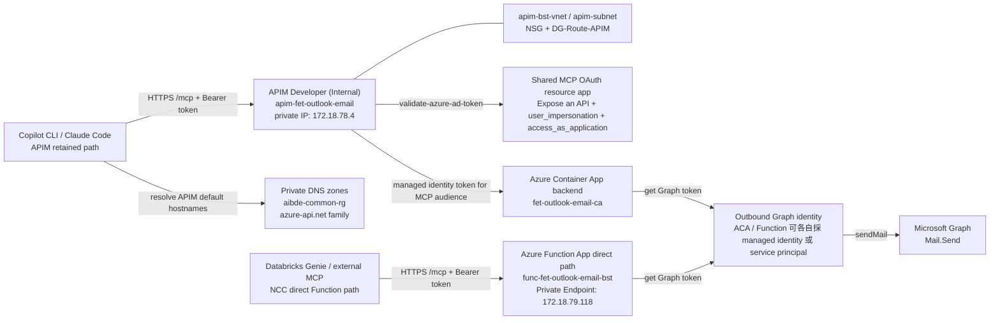
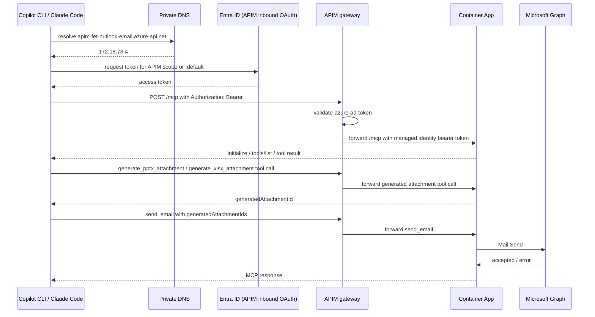

# MCP 伺服器：Outlook Email

這是一個透過 Outlook 傳送電子郵件的 MCP 伺服器，並涵蓋 **認證** 情境。

## 安裝

[](https://vscode.dev/redirect?url=vscode%3Amcp%2Finstall%3F%7B%22name%22%3A%22outlook-email%22%2C%22gallery%22%3Afalse%2C%22command%22%3A%22docker%22%2C%22args%22%3A%5B%22run%22%2C%22-i%22%2C%22--rm%22%2C%22ghcr.io%2Fmicrosoft%2Fmcp-dotnet-samples%2Foutlook-email%3Alatest%22%5D%7D) [](https://insiders.vscode.dev/redirect?url=vscode-insiders%3Amcp%2Finstall%3F%7B%22name%22%3A%22outlook-email%22%2C%22gallery%22%3Afalse%2C%22command%22%3A%22docker%22%2C%22args%22%3A%5B%22run%22%2C%22-i%22%2C%22--rm%22%2C%22ghcr.io%2Fmicrosoft%2Fmcp-dotnet-samples%2Foutlook-email%3Alatest%22%5D%7D) [](https://aka.ms/vs/mcp-install?%7B%22name%22%3A%22outlook-email%22%2C%22gallery%22%3Afalse%2C%22command%22%3A%22docker%22%2C%22args%22%3A%5B%22run%22%2C%22-i%22%2C%22--rm%22%2C%22ghcr.io%2Fmicrosoft%2Fmcp-dotnet-samples%2Foutlook-email%3Alatest%22%5D%7D)

## 先決條件

- [.NET 10 SDK](https://dotnet.microsoft.com/download/dotnet/10.0)
- [Visual Studio Code](https://code.visualstudio.com/)，並安裝
  - [C# Dev Kit](https://marketplace.visualstudio.com/items/?itemName=ms-dotnettools.csdevkit) 擴充功能
- [Azure CLI](https://learn.microsoft.com/cli/azure/install-azure-cli)
- [Azure Developer CLI](https://learn.microsoft.com/azure/developer/azure-developer-cli/install-azd)
- [PowerShell 7](https://learn.microsoft.com/powershell/scripting/install/installing-powershell)（若要使用 `azd` 的 `postdeploy` 自動驗證 hook）
- [Docker Desktop](https://docs.docker.com/get-started/get-docker/)

## 內容包含

- Outlook Email MCP 伺服器可在下列情境中執行：
  - 作為遠端 MCP 伺服器，透過 Azure API Management 使用 **OAuth authentication**
  - 作為遠端 MCP 伺服器，透過 Azure Container Apps 作為 `azd` 的主要部署 backend，並可由 APIM retained path 前轉
  - 作為本機執行的 MCP 伺服器，不額外啟用 MCP transport 認證
- Outlook Email MCP 伺服器包含以下內容：

  | 組成元件 | 名稱 | 說明 | 用法 |
  |----------|------|------|------|
  | Tools | `generate_pptx_attachment` | 根據結構化投影片內容產生 `.pptx` 附件，並回傳可供 `send_email` 使用的附件識別碼。 | `#generate_pptx_attachment` |
  | Tools | `generate_xlsx_attachment` | 根據結構化工作表、資料表與圖表內容產生 `.xlsx` 附件，並回傳可供 `send_email` 使用的附件識別碼。 | `#generate_xlsx_attachment` |
  | Tools | `send_email` | 將電子郵件寄送給收件者，並可選擇加入 reply-to 位址與附件。 | `#send_email` |

`send_email` 也接受選用的 `attachments`。每個附件項目應包含：

- `name`：電子郵件中顯示的檔名
- `contentType`：MIME 類型，例如 `application/pdf`
- `contentBytesBase64`：以 Base64 編碼的檔案內容

目前支援一般檔案附件，因此 **CSV** 與 **XLSX** 都可直接使用，只要提供正確的 MIME 類型：

- `text/csv`
- `application/vnd.openxmlformats-officedocument.spreadsheetml.sheet`

預設限制如下：

- 最多 **10** 個附件
- 每個附件最大 **3 MiB**

若需要更大的附件，必須另外實作大型附件上傳流程；目前 `send_email` 不包含 upload session。

除了直接提供 `attachments` 之外，`send_email` 也支援 `generatedAttachmentIds`。這個欄位用來接收 `generate_pptx_attachment`、`generate_xlsx_attachment` 等工具產生並暫存在伺服器端的附件識別碼。

- 如果你的流程是 **Databricks Genie 查詢結果 -> LLM / 專業 skill 整理內容 -> 產生 PPTX / XLSX -> 寄信**，建議優先用這條路徑。
- 這樣可以避免把整個 `.pptx` / `.xlsx` 的 Base64 內容放回模型上下文中搬來搬去。
- `generatedAttachmentIds` 與 `attachments` 可以同時提供，寄信前會合併計算附件總數與大小限制。

範例：

```json
{
  "attachments": [
    {
      "name": "hello.txt",
      "contentType": "text/plain",
      "contentBytesBase64": "SGVsbG8sIHdvcmxkIQ=="
    }
  ]
}
```

完整 payload 範例：

```json
{
  "title": "本週報表",
  "body": "請參考附件。",
  "sender": "shared-mailbox@contoso.com",
  "recipients": "alice@contoso.com; bob@contoso.com",
  "replyTo": "owner@contoso.com",
  "attachments": [
    {
      "name": "report.csv",
      "contentType": "text/csv",
      "contentBytesBase64": "YSxiLGMKMSwyLDMK"
    },
    {
      "name": "report.xlsx",
      "contentType": "application/vnd.openxmlformats-officedocument.spreadsheetml.sheet",
      "contentBytesBase64": "UEsDBBQAAAAIAAA..."
    }
  ]
}
```

> 若有設定 `AllowedSenders`，`sender` 必須位於允許清單中。若有設定 `AllowedReplyTo`，`replyTo` 也必須位於允許清單中。

### 建議流程：先產生伺服器端附件，再用 `send_email` 寄出

對於 **Genie -> LLM -> PPTX / XLSX -> Email** 這類 workflow，建議將責任切成三段：

1. **資料取得與整理**：先由 Databricks Genie 取回資料，再由 LLM 或專業 skill 整理成 deck outline / slide spec。
2. **附件渲染**：依輸出型態呼叫 `generate_pptx_attachment` 或 `generate_xlsx_attachment`，只負責把結構化內容轉成附件。
3. **寄送**：把前一步回傳的 `generatedAttachmentId` 放進 `send_email.generatedAttachmentIds`。

`generate_pptx_attachment` 本身不負責推論商業內容，也不會替你補齊分析結論；它應該吃的是**已經整理好的投影片結構**。

#### `generate_pptx_attachment` 輸入重點

- `slides`：必要欄位，陣列中的每一項代表一張投影片。
- `kind`：目前支援 `title` 與 `content`。
- `title`：每張投影片都需要。
- `subtitle`：只用於 `title` 頁。
- `body`：內容頁內文，可用換行切成多段。
- `bullets`：內容頁條列項目。
- `fileName`：選填，若未提供 `.pptx` 副檔名會自動補上。
- `themeColorHex`：選填，6 位十六進位色碼，例如 `2F5597`。

#### 預設輸出模板（商務簡報 baseline）

- **封面頁**：使用獨立 hero panel，適合放主題與副標。
- **內容頁**：使用 section title + card panel，讓重點區塊更像正式簡報而不是純文字頁。
- **條列**：`bullets` 會轉成真正的 paragraph bullet 與縮排，不再只是把 `•` 字元硬塞進文字。
- **字型與層次**：預設使用 `Aptos` + `Microsoft JhengHei`，並加入較穩定的行距、段落間距與 footer。
- **頁腳**：內容頁會帶 deck title 與頁碼，讓輸出更接近會議簡報格式。

#### 呼叫端建議：先整理成商務簡報語氣

`generate_pptx_attachment` 會負責**排版與渲染**，但不會自動把原始資料、除錯訊息或技術驗證文字潤成主管看的商務簡報。建議在呼叫前先做一層 outline 整理：

1. **一頁一個結論**：不要把一頁寫成流水帳；每張內容頁只放一個核心訊息。
2. **標題寫成結論句**：例如「APAC 成為本季成長主引擎」，不要寫成「Q2 觀察 1」或「驗證結果」。
3. **副標只放範圍資訊**：期間、資料來源、產品線或區域，不要重複標題。
4. **內文先做高階摘要**：`body` 建議 1-2 句 executive summary，交代整體情境與判讀。
5. **條列放觀察 / 影響 / 建議**：`bullets` 建議 3-5 點，每點盡量短，且能對應商業意義或下一步。
6. **結尾頁優先放 next steps / risks**：讓簡報更像決策材料，而不是單純資料輸出。

> 若當前任務是測試、除錯或驗證工具，請不要直接把 `validator 0 errors`、`E2E 成功` 這類工程語氣原樣丟給 `generate_pptx_attachment`；先改寫成符合受眾的商務敘述。

#### `generate_pptx_attachment` 範例 payload

```json
{
  "fileName": "genie-summary",
  "themeColorHex": "2F5597",
  "slides": [
    {
      "kind": "title",
      "title": "2026 Q2 業務摘要",
      "subtitle": "依 4-6 月營運與銷售資料整理"
    },
    {
      "kind": "content",
      "title": "APAC 成為本季成長主引擎",
      "body": "本季整體營收與高毛利產品組合持續改善，區域成長動能主要集中在 APAC 與企業方案。",
      "bullets": [
        "APAC 營收年增 12%，成長速度高於其他主要市場",
        "企業客戶續約率提升，帶動高毛利方案占比上升",
        "庫存老化集中在兩個品類，建議下季優先啟動去化"
      ]
    }
  ]
}
```

成功時會回傳：

- `generatedAttachmentId`
- `name`
- `contentType`
- `slideCount`
- `sizeBytes`
- `expiresInMinutes`

#### 搭配 `send_email` 的範例 payload

```json
{
  "title": "Q2 業務摘要簡報",
  "body": "請參考附件中的 Genie 摘要簡報。",
  "sender": "shared-mailbox@contoso.com",
  "recipients": "alice@contoso.com; bob@contoso.com",
  "generatedAttachmentIds": [
    "272c74fbe1644522b85711c6672f7420"
  ]
}
```

> `generatedAttachmentId` 只會在伺服器端暫存一段時間。若已過期，請重新呼叫 `generate_pptx_attachment`。

### 建議流程：先產生 XLSX，再用 `send_email` 寄出

對於 **Genie -> LLM -> Excel 報表 -> Email** 這類 workflow，建議將責任切成三段：

1. **資料取得與整理**：先把查詢結果整理成工作表、資料表與圖表需要的結構。
2. **報表渲染**：呼叫 `generate_xlsx_attachment`，只負責把結構化內容轉成 `.xlsx`。
3. **寄送**：把前一步回傳的 `generatedAttachmentId` 放進 `send_email.generatedAttachmentIds`。

#### `generate_xlsx_attachment` 輸入重點

- `sheets`：必要欄位，陣列中的每一項代表一張工作表。
- `name`：工作表名稱。若省略會自動補上 `Sheet1`、`Sheet2` 這類預設值。
- `title`：工作表標題，若提供會寫在工作表最上方。
- `tables`：每張工作表至少需要一個資料表。
- `tables[].columns[].type`：支援 `string`、`number`、`date`、`boolean`，若省略則預設為 `string`。
- `tables[].rows`：每格值都以字串提供，服務端會依對應欄位型別解析。
- `charts`：選填，支援 `column`、`bar`、`line`、`pie`。
- `charts[].tableName`：必須對應同一張工作表內某個 `table.name`。
- `charts[].categoryColumn`：分類軸欄位名稱。
- `charts[].valueColumns`：數值欄位名稱陣列；`pie` 只能指定一個 value column。
- `fileName`：選填，若未提供 `.xlsx` 副檔名會自動補上。
- `themeColorHex`：選填，6 位十六進位色碼，例如 `2F5597`。

#### `generate_xlsx_attachment` 範例 payload

```json
{
  "fileName": "regional-dashboard",
  "themeColorHex": "2F5597",
  "sheets": [
    {
      "name": "Revenue",
      "title": "2026 Q2 Regional Revenue",
      "tables": [
        {
          "name": "RegionalRevenue",
          "columns": [
            { "name": "Region" },
            { "name": "Revenue", "type": "number" },
            { "name": "Margin", "type": "number" }
          ],
          "rows": [
            [ "APAC", "1250000", "0.31" ],
            [ "EMEA", "980000", "0.27" ],
            [ "AMER", "1430000", "0.29" ]
          ]
        }
      ],
      "charts": [
        {
          "kind": "column",
          "title": "Revenue by Region",
          "tableName": "RegionalRevenue",
          "categoryColumn": "Region",
          "valueColumns": [ "Revenue" ]
        },
        {
          "kind": "line",
          "title": "Margin Trend by Region",
          "tableName": "RegionalRevenue",
          "categoryColumn": "Region",
          "valueColumns": [ "Margin" ]
        }
      ]
    }
  ]
}
```

成功時會回傳：

- `generatedAttachmentId`
- `name`
- `contentType`
- `sheetCount`
- `tableCount`
- `chartCount`
- `sizeBytes`
- `expiresInMinutes`

#### 搭配 `send_email` 的範例 payload

```json
{
  "title": "Q2 Regional Dashboard",
  "body": "請參考附件中的 Excel 報表。",
  "sender": "shared-mailbox@contoso.com",
  "recipients": "alice@contoso.com; bob@contoso.com",
  "generatedAttachmentIds": [
    "0b65f8bb55fd4b179d0d2b4e4fd6e099"
  ]
}
```

> `generatedAttachmentId` 只會在伺服器端暫存一段時間。若已過期，請重新呼叫 `generate_xlsx_attachment`。

#### 本機 HTTP 直接驗證 `generate_xlsx_attachment -> send_email`（2026-04 實測）

若你要在**不經過 VS Code MCP host** 的情況下，直接用 `curl.exe` 驗證 `generate_xlsx_attachment -> send_email.generatedAttachmentIds`，這輪實測最穩定的順序如下：

1. 啟動本機 HTTP 模式：

   ```powershell
   dotnet run --project .\src\McpSamples.OutlookEmail.HybridApp -- --http
   ```

2. 先用 `tools/list` 確認目前這個 process 真的有載入 `generate_xlsx_attachment`。
3. 準備 **UTF-8** JSON 檔，直接打 `POST http://localhost:5260/mcp` 呼叫 `generate_xlsx_attachment`。
4. 從 SSE `data:` 行取出 `result.content[0].text`，再解一層 JSON，拿到 `generatedAttachmentId`。
5. 把這個 `generatedAttachmentId` 放進 `send_email.generatedAttachmentIds` 再呼叫 `send_email`。

> 這次本機實測成功產出 `copilot-xlsx-e2e.xlsx`，結果是 **1 張工作表、1 個資料表、2 張圖表、4778 bytes**，並成功作為 `send_email` 附件寄出。

direct `/mcp` 呼叫建議至少帶下列 header：

- `Accept: application/json, text/event-stream`
- `Content-Type: application/json`
- `MCP-Protocol-Version: 2025-03-26`

`curl.exe` 最穩定的送法：

```powershell
curl.exe -sS -N `
  -H "Accept: application/json, text/event-stream" `
  -H "Content-Type: application/json" `
  -H "MCP-Protocol-Version: 2025-03-26" `
  --data-binary "@body.json" `
  http://localhost:5260/mcp
```

這條路徑最常踩到的雷：

- `tools/call` 常回 **SSE**，而且 tool payload 可能包在 `result.content[0].text`，不要只讀 `structuredContent`。
- 在 **Windows PowerShell** 下不要直接用 `curl.exe --data-raw` 送中文 JSON；先落成 **UTF-8 檔案**，再用 `--data-binary @body.json`。
- 如果 `tools/list` 看不到 `generate_xlsx_attachment`，先懷疑目前跑著的是**舊 build**，或既有 `McpSamples.OutlookEmail.HybridApp` process 正在鎖住 `bin\Debug`，讓你以為 rebuild 成功，其實還在跑舊版輸出。

<a id="getting-started"></a>
## 開始使用

### 快速起始：我該選哪種執行方式？

| 目標 | 建議路徑 | 你會用到的內容 |
| --- | --- | --- |
| 先確認 MCP tool 能否在本機跑起來 | 本機 STDIO | `dotnet run --project ./src/McpSamples.OutlookEmail.HybridApp`、`.vscode\mcp.stdio.local.json` |
| 想測 HTTP 型態的 MCP 端點 | 本機 HTTP | `dotnet run --project ./src/McpSamples.OutlookEmail.HybridApp -- --http`、`.vscode\mcp.http.local.json` |
| 想模擬 Azure Functions custom handler | 本機 Function app | `local.settings.json`、`func start`、`.vscode\mcp.http.local-func.json` |
| 想驗證容器封裝 | 容器 | `docker build`、`docker run` |
| 想做正式部署或遠端連線 | Azure | `azd up`、遠端 `.vscode\mcp.http.remote-*.json` |

如果你是第一次接手這個 sample，建議順序是：**本機 STDIO / HTTP → 本機 Function app → Azure**。先完成低成本本機驗證，再往雲端推進，通常比較省時也比較省錢。

- [取得儲存庫根目錄](#getting-repository-root)
- [在 Entra ID 註冊應用程式](#registering-an-app-on-entra-id)
- [執行 MCP 伺服器](#running-mcp-server)
  - [在本機](#on-a-local-machine)
  - [在本機以 Function app 執行](#on-a-local-machine-as-a-function-app)
  - [在容器中](#in-a-container)
  - [在 Azure 上](#on-azure)
- [將 MCP 伺服器連線到 MCP 主機／客戶端](#connect-mcp-server-to-an-mcp-hostclient)
  - [VS Code + Agent Mode + 本機 MCP 伺服器](#vs-code--agent-mode--local-mcp-server)
- [常見陷阱與排錯入口](#common-troubleshooting)

<a id="getting-repository-root"></a>
### 取得儲存庫根目錄

1. 取得儲存庫根目錄。

    ```bash
    # bash/zsh
    REPOSITORY_ROOT=$(git rev-parse --show-toplevel)
    ```

    ```powershell
    # PowerShell
    $REPOSITORY_ROOT = git rev-parse --show-toplevel
    ```

<a id="registering-an-app-on-entra-id"></a>
### 在 Entra ID 註冊應用程式

> 本節適用於在本機或本機容器中執行 MCP 伺服器。若要將此 MCP 伺服器部署到 Azure，可略過本節。

> 這個腳本會替本機測試用 app 註冊 **Microsoft Graph `Mail.Send` application permission**。要成功寄信，除了 tenant / client / secret 之外，目標 `sender` 信箱也必須存在於 **Exchange Online**，且租戶管理員必須完成 admin consent。

1. 執行下列腳本。

    ```bash
    # bash/zsh
    cd $REPOSITORY_ROOT/outlook-email
    ./register-app.sh
    ```

    ```powershell
    # PowerShell
    cd $REPOSITORY_ROOT/outlook-email
    ./Register-App.ps1
    ```

1. 記下 tenant ID、client ID 與 client secret 值。

#### 註冊失敗時先檢查這些項目

| 情境 | 常見症狀 | 先檢查什麼 |
| --- | --- | --- |
| Azure CLI 尚未登入正確租戶 | 腳本一開始就失敗，或建立到錯的 tenant | 先執行 `az login`，必要時加上 `--tenant <TENANT_ID>`，再用 `az account show` 確認目前租戶 |
| 帳號沒有建立應用程式的權限 | 顯示權限不足、無法建立 app registration | 確認租戶允許一般使用者註冊 app，或改用具備 `Application Administrator` / `Cloud Application Administrator` / `Application Developer` 權限的帳號 |
| Graph 權限已加入但寄信仍失敗 | 後續呼叫 `send_email` 時出現授權錯誤 | 確認 app 具有 **Microsoft Graph `Mail.Send` application permission**，且租戶管理員已完成 admin consent |
| `sender` 信箱不存在或不可用 | 認證成功但寄信時找不到信箱或寄件失敗 | 確認目標寄件者存在於 **Exchange Online**，且目前租戶 / app 的設計允許代表該信箱寄信 |
| client secret 抄錯或已過期 | 啟動後取得 token 失敗 | 重新確認 `client secret` 值是否完整、未過期，並與目前 app registration 的有效密鑰一致 |

<a id="running-mcp-server"></a>
### 執行 MCP 伺服器

<a id="on-a-local-machine"></a>
#### 在本機

1. 執行 MCP 伺服器應用程式。

    ```bash
    cd $REPOSITORY_ROOT/outlook-email
    dotnet run --project ./src/McpSamples.OutlookEmail.HybridApp
    ```

   > 請務必記下 `McpSamples.OutlookEmail.HybridApp` 專案的絕對目錄路徑。

    > 本機不額外保護 MCP transport，**不代表寄信到 Microsoft Graph 不需要認證**。若要真的寄信，仍需透過命令列參數、user secrets 或 Azure managed identity 提供 Graph 認證。

    **參數：**

   - `--http`：表示以 streamable HTTP 類型執行此 MCP 伺服器。加入此開關後，MCP 伺服器 URL 會是 `http://localhost:5260`。
   - `--tenant-id`/`-t`: 用於登入的 tenant ID。
   - `--client-id`/`-c`: 用於登入的 client ID。
   - `--client-secret`/`-s`: 用於登入的 client secret。

   加入這些參數後，可用下列方式執行 MCP 伺服器：

    ```bash
    dotnet run --project ./src/McpSamples.OutlookEmail.HybridApp -- --http -t "{{TENANT_ID}}" -c "{{CLIENT_ID}}" -s "{{CLIENT_SECRET}}"
    ```

   除了透過命令列提供 tenant ID、client ID 與 client secret 外，也可以將它們儲存為 user secrets；**本機開發建議優先使用 user secrets，不要把 secret 長期放在命令列參數中**。

    ```bash
    dotnet user-secrets --project ./src/McpSamples.OutlookEmail.HybridApp set EntraId:UseManagedIdentity false
    dotnet user-secrets --project ./src/McpSamples.OutlookEmail.HybridApp set EntraId:TenantId "{{TENANT_ID}}"
    dotnet user-secrets --project ./src/McpSamples.OutlookEmail.HybridApp set EntraId:ClientId "{{CLIENT_ID}}"
    dotnet user-secrets --project ./src/McpSamples.OutlookEmail.HybridApp set EntraId:ClientSecret "{{CLIENT_SECRET}}"
    ```

    > 只要你透過命令列參數、user secrets 或 app settings 明確提供 `EntraId` 的 tenant / client / secret，程式就會優先視為 service principal 模式；若要強制改回 managed identity，請明確設定 `EntraId:UseManagedIdentity=true`。

<a id="on-a-local-machine-as-a-function-app"></a>
#### 在本機以 Function app 執行

1. 將 `local.settings.sample.json` 重新命名為 `local.settings.json`。

    ```bash
    # bash/zsh
    cp $REPOSITORY_ROOT/outlook-email/src/McpSamples.OutlookEmail.HybridApp/local.settings.sample.json \
       $REPOSITORY_ROOT/outlook-email/src/McpSamples.OutlookEmail.HybridApp/local.settings.json
    ```

    ```powershell
    # PowerShell
    Copy-Item -Path $REPOSITORY_ROOT/outlook-email/src/McpSamples.OutlookEmail.HybridApp/local.settings.sample.json `
              -Destination $REPOSITORY_ROOT/outlook-email/src/McpSamples.OutlookEmail.HybridApp/local.settings.json -Force
    ```

1. 開啟 `local.settings.json`，將 `{{TENANT_ID}}`、`{{CLIENT_ID}}` 和 `{{CLIENT_SECRET}}` 分別替換為 tenant ID、client ID 與 client secret 值。

    ```jsonc
    {
      "IsEncrypted": false,
      "Values": {
        "FUNCTIONS_WORKER_RUNTIME": "dotnet-isolated",
        "AzureWebJobsFeatureFlags": "DisableDiagnosticEventLogging",
    
        "UseHttp": "true",
      
        "EntraId__TenantId": "{{TENANT_ID}}",
        "EntraId__ClientId": "{{CLIENT_ID}}",
        "EntraId__ClientSecret": "{{CLIENT_SECRET}}",
        "EntraId__UseManagedIdentity": "false",
        "AllowedSenders__0": "shared-mailbox@contoso.com",
        "AllowedReplyTo__0": "owner@contoso.com",
        "MaxAttachmentCount": "10",
        "MaxAttachmentSizeBytes": "3145728"
      }
    }
    ```

    > `AllowedSenders__0` 代表第一個允許的寄件者；若要加更多寄件者，可依序加入 `AllowedSenders__1`、`AllowedSenders__2`。
    >
    > `AllowedReplyTo__0` 代表第一個允許的回覆地址；若要加更多回覆地址，可依序加入 `AllowedReplyTo__1`、`AllowedReplyTo__2`。
    >
    > `MaxAttachmentCount` 與 `MaxAttachmentSizeBytes` 會控制附件數量與單檔大小。
    >
    > 現在 Graph 認證模式的優先序如下：
    >
    > 1. `EntraId__UseManagedIdentity`：若有明確設定，直接以它為準
    > 2. 若未設定，但 `EntraId__TenantId` / `EntraId__ClientId` / `EntraId__ClientSecret` 有提供，則改用 service principal
    > 3. 若以上都沒有，且存在 `AZURE_CLIENT_ID`，才回退到 managed identity
    >
    > 當程式判斷要使用 service principal 時，`EntraId__TenantId`、`EntraId__ClientId`、`EntraId__ClientSecret` 三者必須完整；否則啟動後第一次建立 Graph client 就會明確失敗。
    >
    > `local.settings.json` 已被 `.gitignore` 忽略，實際授權用的 sender / replyTo 應寫在這個本機檔，不要把真實值回填到 `local.settings.sample.json`。
    >
    > 若只是一般本機開發，仍優先建議把 Graph secret 放在 `dotnet user-secrets`；`local.settings.json` 比較適合 Functions / custom handler 本機整體演練。

1. 執行 MCP 伺服器應用程式。

    ```bash
    cd $REPOSITORY_ROOT/outlook-email/src/McpSamples.OutlookEmail.HybridApp
    func start
    ```

<a id="in-a-container"></a>
#### 在容器中

1. 將 MCP 伺服器 應用程式建置為 容器映像。

    > **注意：** 以下指令是給**本機開發 / 本機容器測試**使用。若要建置並推送到 ACR，或要部署到 ACA，請改看後面的 **「推送到 ACR 的建議命名規則」** 段落，並固定使用 `Dockerfile.outlook-email-azure`。

    ```bash
    cd $REPOSITORY_ROOT
    docker build -f Dockerfile.outlook-email -t outlook-email:latest .
    ```

1. 在 container 中執行 MCP 伺服器 應用程式。

    ```bash
    docker run -i --rm -p 8080:8080 outlook-email:latest
    ```

   或者，也可以使用容器登錄中的容器映像。

    ```bash
    docker run -i --rm -p 8080:8080 ghcr.io/microsoft/mcp-dotnet-samples/outlook-email:latest
    ```

   **參數：**

   - `--http`：表示以 streamable HTTP 類型執行此 MCP 伺服器。加入此開關後，MCP 伺服器 URL 會是 `http://localhost:8080`。
   - `--tenant-id`/`-t`: 用於登入的 tenant ID。
   - `--client-id`/`-c`: 用於登入的 client ID。
   - `--client-secret`/`-s`: 用於登入的 client secret。

   加入這些參數後，可用下列方式執行 MCP 伺服器：

    ```bash
    # 使用本機容器映像
    docker run -i --rm -p 8080:8080 outlook-email:latest --http -t "{{TENANT_ID}}" -c "{{CLIENT_ID}}" -s "{{CLIENT_SECRET}}"
    ```

     ```bash
     # 使用容器登錄中的容器映像
     docker run -i --rm -p 8080:8080 ghcr.io/microsoft/mcp-dotnet-samples/outlook-email:latest --http -t "{{TENANT_ID}}" -c "{{CLIENT_ID}}" -s "{{CLIENT_SECRET}}"
     ```

##### 推送到 ACR 的建議命名規則

若你要把這個 sample 的容器映像推到 **Azure Container Registry (ACR)**，建議使用下列格式：

`<acr-login-server>/fet-mcp-server-dotnet/<branch-path>:<utc-timestamp>`

若目標是 **Azure Container Apps (ACA)**，或是任何會經過 **`az acr build`**、**ACR Task**、`azd` containerapp remote build 的路徑，請固定使用 **`Dockerfile.outlook-email-azure`**。`Dockerfile.outlook-email` 內含 `FROM --platform=$BUILDPLATFORM ...`，目前容易在 ACR dependency scanner 階段失敗，不建議再拿去做 ACR / ACA 建置。

- `fet-mcp-server-dotnet`：固定 repository root
- `branch-path`：用 repository path 模擬 branch 分目錄，例如 `main`、`develop`、`feature/pptx-mailer`
- `utc-timestamp`：建議使用 UTC `yyyyMMdd-HHmmss`，例如 `20260418-101011`

> ACR / OCI tag 是平的；若要做 branch 分目錄，請把 branch 放在 **repository path**，不要塞進 tag。

| Branch | 完整 image ref 範例 |
| --- | --- |
| `main` | `myacr.azurecr.io/fet-mcp-server-dotnet/main:20260418-101011` |
| `develop` | `myacr.azurecr.io/fet-mcp-server-dotnet/develop:20260418-101011` |
| `feature/pptx-mailer` | `myacr.azurecr.io/fet-mcp-server-dotnet/feature/pptx-mailer:20260418-101011` |
| `release/2026-04` | `myacr.azurecr.io/fet-mcp-server-dotnet/release/2026-04:20260418-101011` |

```bash
# bash / zsh
ACR_LOGIN_SERVER="myacr.azurecr.io"
IMAGE_NAME="fet-mcp-server-dotnet"
BRANCH_NAME="${GITHUB_REF_NAME:-main}"

BRANCH_PATH=$(echo "$BRANCH_NAME" \
  | tr '[:upper:]' '[:lower:]' \
  | sed 's#^refs/heads/##' \
  | sed 's#[^a-z0-9/_\.-]#-#g' \
  | sed 's#//*#/#g' \
  | sed 's#^/*##; s#/*$##')

TIMESTAMP=$(date -u +%Y%m%d-%H%M%S)
IMAGE_REF="${ACR_LOGIN_SERVER}/${IMAGE_NAME}/${BRANCH_PATH}:${TIMESTAMP}"

docker build -t "$IMAGE_REF" -f Dockerfile.outlook-email-azure .
docker push "$IMAGE_REF"
```

```powershell
# PowerShell
$acrLoginServer = "myacr.azurecr.io"
$imageName = "fet-mcp-server-dotnet"
$branchName = if ($env:GITHUB_REF_NAME) { $env:GITHUB_REF_NAME } else { "main" }

$branchPath = $branchName.ToLower()
$branchPath = $branchPath -replace "^refs/heads/", ""
$branchPath = [regex]::Replace($branchPath, "[^a-z0-9/_\.-]", "-")
$branchPath = [regex]::Replace($branchPath, "/+", "/").Trim("/")

$timestamp = (Get-Date).ToUniversalTime().ToString("yyyyMMdd-HHmmss")
$imageRef = "$acrLoginServer/$imageName/$branchPath`:$timestamp"

docker build -t $imageRef -f Dockerfile.outlook-email-azure .
docker push $imageRef
```

##### 容器 image naming / CI 常見踩雷

| 踩雷點 | 常見症狀 | 建議做法 |
| --- | --- | --- |
| 把 branch 塞進 tag | `docker build -t ...` / `docker push` 出現 `invalid reference format` | branch 分目錄放在 repository path，例如 `fet-mcp-server-dotnet/feature/pptx-mailer:20260418-101011` |
| 直接拿 Git branch 名稱組 image ref | `refs/heads/main`、大寫、空白、`#`、中文等字元造成 ref 非法或不一致 | 先轉小寫、移除 `refs/heads/`，其餘不安全字元轉成 `-` |
| GitHub Actions / GHCR 直接用 `${{ github.repository }}` 組 image ref | `docker buildx build` 報 `repository name must be lowercase`，常見例子是 `ghcr.io/Fet-ycliang/...:latest` | 先把 owner / repo 全轉小寫，再用同一個 normalized name 產生 `metadata-action` images、手動 `latest` / version tags，以及 attestation subject |
| 用本地時區當 tag | 跨時區比對版本時很難對帳 | tag 一律用 UTC `yyyyMMdd-HHmmss` |
| 同一秒內產出多個映像 | 後推的映像覆蓋前一個 tag | 若 CI 有高併發需求，可改成 `yyyyMMdd-HHmmss-<short-sha>` |
| 用 `Dockerfile.outlook-email` 建 ACR / ACA 映像 | `az acr build` / ACR Task 卡在 dependency scanner，常見訊息是 `unable to understand line FROM --platform=$BUILDPLATFORM ...` | ACA / ACR 路線固定改用 `Dockerfile.outlook-email-azure` |
| 把 `azd up` 當成可完全自訂 image naming 的流程 | 以為 `azd` 會照你想要的 repository / tag 命名規則產生 image | `azure.yaml` 現在會用 `host: containerapp` + `remoteBuild: true` 自動推到 azd 管理的 ACR；若你要精準控制 image naming，仍請改走手動 `docker build/push` 或 CI pipeline |
| workflow matrix 沒留意 `fail-fast` | 同一個 run 只有一個 image 真失敗，其餘 job 卻顯示 `cancelled` / `The operation was canceled.` | 先找第一個 `failure` job 當根因；若要保留每個 image 的完整結果、不要讓其他 image 被連帶取消，請設定 `strategy.fail-fast: false` |

<a id="on-azure"></a>
#### 在 Azure 上

1. **重要：** 先確認你具備必要權限：
   - 你的 Azure 帳戶必須在 訂用帳戶層級具備 `Microsoft.Authorization/roleAssignments/write` 權限，例如 [Role Based Access Control Administrator](https://learn.microsoft.com/azure/role-based-access-control/built-in-roles/privileged#role-based-access-control-administrator)、[User Access Administrator](https://learn.microsoft.com/azure/role-based-access-control/built-in-roles/privileged#user-access-administrator) 或 [Owner](https://learn.microsoft.com/azure/role-based-access-control/built-in-roles/privileged#owner)。
   - 你的 Azure 帳戶也必須在 訂用帳戶層級具備 `Microsoft.Resources/deployments/write` 權限。

1. 切換到目錄。

    ```bash
    cd $REPOSITORY_ROOT/outlook-email
    ```

1. 登入 Azure。

    ```bash
    # 使用 Azure Developer CLI 登入
    azd auth login
    ```

1. 將 MCP 伺服器應用程式部署到 Azure。

    ```bash
    azd up
    ```

    在佈建與部署過程中，系統會要求提供 subscription ID、location 與 環境名稱。

    > 目前 `azure.yaml` 已改成 `host: containerapp`，並使用 `Dockerfile.outlook-email-azure` + `remoteBuild: true`。因此 `azd up` / `azd deploy` 會自動把映像建到 azd 管理的 ACR，然後 rollout 到 Container App。若你要完全自訂 repository path / tag naming，仍請改走手動 `docker build` / `docker push` 或你自己的 CI pipeline。
    >
    > 這也代表 `azd` 主要會更新 **ACA backend**；repo 內仍保留部分 Function-based 資源 / 設定是為了既有路徑與文件參考，但它不再是這條部署流程的 primary rollout target。

##### 上版後自動驗證（Asia/Taipei）

- `azure.yaml` 已替 `outlook-email` service 掛上 **`postdeploy` hook**：`./hooks/postdeploy-validate-mcp.ps1`（service hook 的 `cwd` 是 `project: src/McpSamples.OutlookEmail.HybridApp`，所以實際檔案位置仍是 `src/McpSamples.OutlookEmail.HybridApp/hooks/postdeploy-validate-mcp.ps1`）
- 只要執行 `azd deploy` 或 `azd up`，部署完成後就會**自動驗證剛 rollout 的 direct ACA `/mcp` 路徑**
- hook 的日誌時間戳固定以 **台北時區（UTC+8 / Asia/Taipei）** 輸出，方便和你們的維運時間對齊

這個 hook 目前會自動執行下列 smoke tests：

| 類型 | 驗證項目 | 預期結果 | 是否自動執行 |
| --- | --- | --- | --- |
| MCP transport | `POST /mcp` with `initialize` | `200` | 是 |
| MCP discovery | `POST /mcp` with `tools/list` | `200`，且包含 `send_email`、`generate_pptx_attachment` 與 `generate_xlsx_attachment` | 是 |
| Tool existence | `send_email` / `generate_pptx_attachment` / `generate_xlsx_attachment` 是否可被列出 | `tools/list` 內可見 | 是 |
| 業務破壞性測試 | `send_email` 真實寄信 | 成功或依測試案例失敗 | 否，建議在受控信箱做 |

驗證 hook 取 token 的優先順序：

1. 若你有提供 **dedicated validation app**：

   ```bash
   azd env set MCP_VALIDATION_TENANT_ID "{{TENANT_ID}}"
   azd env set MCP_VALIDATION_CLIENT_ID "{{VALIDATION_CALLER_APP_ID}}"
   azd env set MCP_VALIDATION_CLIENT_SECRET "{{VALIDATION_CALLER_APP_SECRET}}"
   ```

   hook 會改走 **client credentials**，以 `api://<MCP_OAUTH_CLIENT_ID>/.default` 驗證 direct ACA `/mcp`。

1. 若你**沒有**提供上面三個值，hook 會 fallback 成：

   - 直接使用目前 Azure CLI 登入身分
   - 呼叫 `az account get-access-token --scope "api://<MCP_OAUTH_CLIENT_ID>/user_impersonation"`

> 不論 hook 是走 Azure CLI fallback 還是 dedicated validation app，重點都是它必須能對 `MCP_OAUTH_*` 這顆 resource app 拿到有效 token。
> - 若 hook 走 Azure CLI fallback，請確認目前登入身分可取得 `user_impersonation`
> - 若 hook 走 dedicated validation app，請先把那顆 validation app 指派到 resource app 的 `access_as_application`

1. 正式環境建議先設定下列 azd 環境變數，再部署：

    ```bash
    azd env set MCP_ALLOWED_SENDERS_CSV "shared-mailbox@contoso.com;ops-mailbox@contoso.com"
    azd env set MCP_ALLOWED_REPLY_TO_CSV "owner@contoso.com"
    azd env set AZURE_ALLOW_USER_IDENTITY_RBAC false
    ```

     > `MCP_ALLOWED_SENDERS_CSV` 會在 Container App 上展開為 `AllowedSenders__0`、`AllowedSenders__1` 等環境變數，讓正式環境維持與 local 相同的 sender allowlist。
     >
     > `MCP_ALLOWED_REPLY_TO_CSV` 會在 Container App 上展開為 `AllowedReplyTo__0`、`AllowedReplyTo__1` 等環境變數。
     >
     > `AZURE_ALLOW_USER_IDENTITY_RBAC` 預設應保持 `false`。只有在你真的需要讓部署用互動身分暫時取得 Storage / Application Insights 的除錯權限時，才短暫改成 `true`。

1. 若你要讓 Azure 資源名稱直接與專案用途掛勾，並補齊成本 / 維運 tags，可再設定下列 azd 環境變數：

    ```bash
    azd env set AZURE_RESOURCE_NAME_STEM "fet-outlook-email-bst"
    azd env set AZURE_TAG_COST_CENTER "3901"
    azd env set AZURE_TAG_PURPOSE "ai_lab"
    azd env set AZURE_TAG_ENV_TYPE "Develop"
    azd env set AZURE_TAG_WORKLOAD "outlook-email"
    azd env set AZURE_TAG_SERVICE "mcp"
    azd env set AZURE_TAG_MANAGED_BY "azd"
    ```

      > 若未設定 `AZURE_RESOURCE_NAME_STEM`，Bicep 會預設沿用 `environmentName`。以目前核定的命名方式，建議使用 `fet-outlook-email-bst`，讓資源名稱能直接看出 workload。
      >
      > 這組 naming / tag baseline 套用後，預期名稱會像：
      > - Container App：`ca-fet-outlook-email-bst`
      > - Container Apps Environment：`cae-fet-outlook-email-bst`
      > - Azure Container Registry：`crfetoutlookemailbstacr`
      > - API Management：`apim-fet-outlook-email-bst`
      > - Application Insights：`appi-fet-outlook-email-bst`
      > - Log Analytics：`log-fet-outlook-email-bst`
      > - User-assigned managed identity：`id-fet-outlook-email-bst`
      > - Dashboard：`dash-fet-outlook-email-bst`
     >
      > `AZURE_TAG_*` 未設定時，sample 會預設使用：`cost_center=3901`、`Purpose=ai_lab`、`EnvType=Develop`、`workload=outlook-email`、`service=mcp`、`managed_by=azd`。

1. 若你需要 **精準固定 APIM 名稱**，而不是沿用 sample 的標準衍生命名，可再設定：

    ```bash
    azd env set AZURE_APIM_NAME "fet-mcp-apim-bst"
    ```

     > 未設定 `AZURE_APIM_NAME` 時，APIM 會沿用標準衍生命名；以上面的 baseline 例子來看，預設會是 `apim-fet-outlook-email-bst`。
     >
     > 設定 `AZURE_APIM_NAME` 後，APIM 會直接使用你提供的名稱，例如 `fet-mcp-apim-bst`。
     >
      > `AZURE_APIM_NAME` 只在 `AZURE_DEPLOY_APIM=true` 時有意義。

1. 若你要讓 azd **直接接手既有 ACA 名稱**，並讓 APIM retained path 跟著前轉到同一個 ACA，可再設定：

    ```bash
    azd env set AZURE_APIM_BACKEND_CONTAINER_APP_NAME "fet-outlook-email-ca"
    ```

     > 這個值會讓 `infra\resources.bicep` 先沿用既有 ACA 的 managed environment / 目前 image 當作 deploy baseline，再把 `azd` service 與 APIM backend 都對準同一個 ACA。
     >
     > 若未設定 `AZURE_APIM_BACKEND_CONTAINER_APP_NAME`，template 會改用 sample 衍生名稱建立新的 ACA，並讓 APIM backend 指向那個新 ACA。
     >
     > 目前 template 假設這個 ACA 與本次 deployment 在**同一個 resource group**，而且已啟用 ingress 並有有效 FQDN；若 ACA 在其他 RG / subscription，或根本沒有 ingress，請先擴充 template 再部署。
     >
     > 這個參數會讓 template 重新管理該 ACA 的 image、identity 與 registry wiring；但 **不會**順手補上你環境外額外需要的 auth / network hardening。若你要保留 APIM 作為正式入口，請自行確保該 ACA 不會變成繞過 APIM 的公開或未受控入口。
     >
     > 目前這輪已核對的 retained path backend 是 **`fet-outlook-email-ca`**，也就是 `https://fet-outlook-email-ca.proudpebble-d0c3559f.eastus2.azurecontainerapps.io`。

1. 若你要把 **APIM 也放進 internal/private VNet mode**，可再設定：

     ```bash
     azd env set AZURE_DEPLOY_APIM true
     azd env set AZURE_APIM_SKU "Developer"
     azd env set AZURE_APIM_INTERNAL_VNET true
     azd env set AZURE_EXISTING_VNET_NAME "apim-bst-vnet"
     azd env set AZURE_APIM_SUBNET_NAME "apim-subnet"
     azd env set AZURE_APIM_SUBNET_ADDRESS_PREFIX "172.18.78.0/25"
     azd env set AZURE_APIM_SUBNET_ROUTE_TABLE_RESOURCE_ID "/subscriptions/<subscription-id>/resourceGroups/NetworkWatcherRG/providers/Microsoft.Network/routeTables/DG-Route-APIM"
     azd env set AZURE_APIM_SUBNET_NSG_RESOURCE_ID "/subscriptions/<subscription-id>/resourceGroups/<network-rg>/providers/Microsoft.Network/networkSecurityGroups/<apim-subnet-nsg>"
     azd env set AZURE_PRIVATE_DNS_ZONE_RESOURCE_GROUP_NAME "aibde-common-rg"
     ```

      > 這條 internal APIM 路徑目前仍假設你是**重用既有 VNet / subnet**。若只提供 `AZURE_APIM_SUBNET_NAME`，Bicep 只會直接參考既有 subnet；若 `AZURE_APIM_SUBNET_ADDRESS_PREFIX` 也有值，Bicep 會在該既有 VNet 內**更新 APIM subnet 的 address prefix**，適合像 `172.18.78.0/25` 這種調整。
      >
      > 這條更新路徑仍要求 `AZURE_APIM_SUBNET_NAME` 對應的 subnet **不能有 delegation**。template 會把 delegation 明確設為空陣列；若 Azure 不接受該 subnet 原地縮編 / 調整，部署就會失敗，這時應改走**新 subnet 遷移**而不是只改參數。
      >
      > `AZURE_APIM_SUBNET_ROUTE_TABLE_RESOURCE_ID` 與 `AZURE_APIM_SUBNET_NSG_RESOURCE_ID` 在這條更新路徑上**建議視為必填**；template 目前不會自動回讀既有 subnet 再幫你保留 route table / NSG，以避免對同一條 subnet 形成 self-reference/circular dependency。
      >
      > 若這條 APIM subnet 還依賴額外的 service endpoints 或其他 subnet 細節，請先盤點並在變更前明確處理；不要假設 template 會自動保留所有既有屬性。
      >
      > **這次實測結果（`apim-app-bst-rg / apim-bst-vnet / apim-subnet`）**：目前 live `apim-subnet` 是 **`172.18.78.0/24`**，且已有 APIM 產生的 active allocations。嘗試直接改成 **`172.18.78.0/25`** 時，不論是 `az network vnet subnet update` 還是 `azd provision`，Azure 都回：
      >
      > `InUsePrefixCannotBeDeleted: IpPrefix 172.18.78.0/24 on Subnet apim-subnet has active allocations and cannot be deleted.`
      >
      > 這代表目前這條 subnet **不能原地縮編**；若目標真的要 `/25`，應改走 **新 subnet 建立 + APIM 遷移**，不要再預期只靠改 env / Bicep 參數就能直接收斂。
      >
      > **IP sizing 參考（給後面的人快速估算）**：
      >
      > - Azure 會先保留每個 subnet 的 **5 個 IP**
      > - 目前這個 sample 實際使用的是 **classic APIM Developer + Internal VNet injection**
      > - 這條路徑至少還要再吃掉：
      >   - **1 個 IP**：APIM Developer instance
      >   - **1 個 IP**：internal load balancer
      >
      > 所以可先用下面這組心智模型判斷：
      >
      > - **`/29`**：8 個總 IP，扣掉 Azure 保留 5 個後，剩 **3 個可用 IP**，可視為這條 internal Developer 路徑的理論最小值
      > - **`/25`**：128 個總 IP，扣掉 Azure 保留 5 個後，剩 **123 個可用 IP**
      > - **`/24`**：256 個總 IP，扣掉 Azure 保留 5 個後，剩 **251 個可用 IP**
      >
      > 換句話說，這次卡住的原因**不是 `/25` 容量不夠**；真正的問題是目前 live `apim-subnet` 的 **`/24` prefix 已有 active allocations**，Azure 不允許直接刪掉舊 prefix 後原地縮成 `/25`。
      >
      > 目前實際踩到的最小必要規則至少包含：
      > - **Inbound** `ApiManagement` -> `VirtualNetwork` TCP `3443`
      > - **Inbound** `AzureLoadBalancer` -> `VirtualNetwork` TCP `6390`
     >
     > 若這兩條沒先放，internal APIM 很可能會長時間停在 `Activating`，甚至最後 provisioning 失敗。
     >
     > sample 會把 APIM service 以 `virtualNetworkType=Internal` 方式部署到指定 subnet，並在 private DNS zone resource group 建立 / 更新預設 hostname 所需的 zone 與 A record：
     > - `azure-api.net`
     > - `portal.azure-api.net`
     > - `developer.azure-api.net`
     > - `management.azure-api.net`
     > - `scm.azure-api.net`
     >
     > internal mode 不會讓 `https://<apim-name>.azure-api.net` 自動出現在公網 DNS；後續驗證需要從可達該 VNet 的網路路徑進行。

1. 若你這次只想先把 **APIM internal/private 基礎設施** 落地，暫時不建立 MCP API / OAuth app，可再設定：

     ```bash
     azd env set AZURE_DEPLOY_APIM true
     azd env set AZURE_APIM_SKU "Developer"
     azd env set AZURE_APIM_INTERNAL_VNET true
     azd env set AZURE_DEPLOY_APIM_MCP_API false
     ```

      > `AZURE_DEPLOY_APIM_MCP_API=false` 時，sample 仍會部署 APIM service、本次 internal VNet wiring 與 private DNS，但會先**跳過** APIM 內的 MCP API facade。
      >
      > 由於目前 direct Function path 也會共用 `MCP_OAUTH_*` 這顆 resource app 做 Easy Auth，若你沒有提供既有 `MCP_OAUTH_TENANT_ID` / `MCP_OAUTH_CLIENT_ID`，Bicep 仍可能為 Function App auth 建立 `mcpEntraApp`。
      >
      > 這個模式適合先把網路 / DNS / APIM service 骨架建好，等 APIM facade 準備好之後，再把 `AZURE_DEPLOY_APIM_MCP_API` 改回 `true` 補齊保留中的 APIM OAuth 路徑。

1. 若正式環境要先用 **service principal + environment variables**，而不是 managed identity，可再設定下列 azd 環境變數：

    ```bash
    azd env set MCP_ENTRA_USE_MANAGED_IDENTITY false
    azd env set MCP_ENTRA_TENANT_ID "{{TENANT_ID}}"
    azd env set MCP_ENTRA_CLIENT_ID "{{CLIENT_ID}}"
    azd env set MCP_ENTRA_CLIENT_SECRET "{{CLIENT_SECRET_OR_KEYVAULT_REFERENCE}}"
    ```

     > 這組值會進入 Azure Functions 的 app settings：`EntraId__UseManagedIdentity`、`EntraId__TenantId`、`EntraId__ClientId`、`EntraId__ClientSecret`。
     >
     > 當 `MCP_ENTRA_USE_MANAGED_IDENTITY=false` 時，`MCP_ENTRA_TENANT_ID`、`MCP_ENTRA_CLIENT_ID`、`MCP_ENTRA_CLIENT_SECRET` 必須一起提供；缺任何一個都會讓寄信時的 Graph 認證明確失敗。
     >
     > **安全建議順序**：Azure managed identity > Azure service principal + Key Vault reference > local `dotnet user-secrets` > 明文 CLI / env var。若你先把 secret 直接放在 environment variable，後續請盡快把 `MCP_ENTRA_CLIENT_SECRET` 改成 App Service Key Vault reference 字串，例如 `@Microsoft.KeyVault(SecretUri=https://<vault-name>.vault.azure.net/secrets/<secret-name>/<secret-version>)`。
     >
     > 若你要走 managed identity，請不要同時保留 `MCP_ENTRA_TENANT_ID`、`MCP_ENTRA_CLIENT_ID`、`MCP_ENTRA_CLIENT_SECRET`，避免把不需要的 credential 長期留在 Function App app settings 中。

1. 若你要保留 **APIM + OAuth**，但目前 tenant 內不方便讓部署流程自動建立新的 MCP app registration，可改為重用既有 Entra app：

    ```bash
    azd env set MCP_OAUTH_TENANT_ID "{{TENANT_ID}}"
    azd env set MCP_OAUTH_CLIENT_ID "{{EXISTING_MCP_APP_CLIENT_ID}}"
    azd env set MCP_DIRECT_ALLOWED_CLIENT_APPLICATIONS_CSV "{{DATABRICKS_OR_DIRECT_CALLER_APP_ID}}"
    ```

      > `MCP_OAUTH_TENANT_ID` / `MCP_OAUTH_CLIENT_ID` 這兩個值現在會同時用在：
      > - **APIM inbound OAuth / bearer token 驗證**
      > - **Function App direct path 的 Easy Auth audience / issuer**
      >
      > 它們跟上面 `MCP_ENTRA_*` 那組 **Function App 出站呼叫 Graph** 的 service principal 設定不同。
      >
      > 當 `MCP_OAUTH_TENANT_ID` 與 `MCP_OAUTH_CLIENT_ID` 都有提供時，Bicep 會**直接重用**該既有 app，不再嘗試建立 `mcpEntraApp`。
      >
      > 你提供的既有 app 需要已經能代表這條 MCP resource path：至少要有 delegated scope `user_impersonation`，若還要支援 client credentials / M2M，還要再補 application role `access_as_application`；否則部署可過，但 client 端拿 token 時仍會失敗。
      >
      > `MCP_DIRECT_ALLOWED_CLIENT_APPLICATIONS_CSV` 是可選的 direct caller allowlist；若有設定，只有列在這裡的 caller app 才能直接打 Function App private endpoint。APIM backend 自己使用的 managed identity 會由模板自動加入，不需要手動再填一次。

1. 若你要請 administrator 一次補齊 **OAuth / sendMail** 權限，可直接用下面這份需求：

     **A. APIM inbound OAuth（遠端 MCP 入口）**

     - 若要讓部署流程自動建立 / 更新 `mcpEntraApp`：
       - 請把執行 `azd provision` 的部署身分（使用者或 service principal）暫時加入 Microsoft Entra 角色：
         - `Application Administrator`
         - 或 `Cloud Application Administrator`
       - 原因：目前模板會建立 / 更新 **app registration**、**enterprise application (service principal)**、**federated identity credential**，也會做 app role assignment；**只有 Azure subscription RBAC 不夠**。
     - 若不希望部署流程自動建 app：
       - 請 administrator 先提供一顆**專用**的 Entra app registration，並提供：
         - `tenant ID`
         - `client / application ID`
       - 這顆 app 至少要已完成：
         - **Expose an API**
        - 有可供 client 取得 token 的 delegated scope（目前 sample 預期是 `user_impersonation`）
        - 若要支援 M2M / client credentials，另需 application role `access_as_application`
         - 視 tenant 規範完成必要的 consent / assignment

     **B. Function App 出站 `sendMail`（Microsoft Graph）**

     - 若目前繼續用 service principal（`MCP_ENTRA_USE_MANAGED_IDENTITY=false`）：
       - `MCP_ENTRA_CLIENT_ID` 對應的 app / enterprise app 需要 Microsoft Graph **Application** permission：`Mail.Send`
       - 這個 `Mail.Send` 需要 administrator 完成 **admin consent**
       - 需提供 secret 或 certificate 給 Function App；目前 sample 吃 `MCP_ENTRA_CLIENT_SECRET`，正式環境建議改成 **Key Vault reference**
     - 若之後改用 managed identity：
       - 仍然需要 administrator 對 **Function App 使用的 user-assigned managed identity service principal** 授與 Microsoft Graph **Application** permission：`Mail.Send`
       - 同樣需要 **admin consent**
       - 換成 managed identity **不會**自動免除 `Mail.Send` 權限申請
     - 若 Exchange Online 端有啟用 **Application Access Policy** 或 **Application RBAC**：
       - 還需要把實際寄件者 mailbox，或對應的 mail-enabled security group，納入允許範圍；否則即使 `Mail.Send` 已授權，Graph 仍可能回 `AccessDenied`

     > 這次實際遇到的錯誤是 Graph `Forbidden`，發生在 `mcpEntraApp` 建立與 app role assignment；這是 **Entra / Microsoft Graph 權限** 問題，不是 Azure subscription RBAC 問題。

1. 若你要保留 **APIM + OAuth** 的遠端 MCP 路徑，但開發 / 測試階段想先壓低固定成本，可再設定：

    ```bash
    azd env set AZURE_DEPLOY_APIM true
    azd env set AZURE_APIM_SKU "Developer"
    ```

     > `AZURE_APIM_SKU` 預設是 `Basicv2`；改成 `Developer` 後，Bicep 仍會部署同一條 APIM + OAuth MCP gateway 路徑，但較適合 dev / test。
      >
      > `Developer` 不建議直接沿用到 production；若要正式承載團隊使用，請再依 SLA、網路拓撲與流量需求評估 `Basicv2` / `Standardv2` / `Premium`。
      >
      > 若你這次採 `AZURE_DEPLOY_APIM=false`、只想先驗證 direct backend 路徑，`AZURE_APIM_SKU` 與 `AZURE_APIM_NAME` 都會被忽略。

1. 若你要沿用既有 resource group / VNet，而不是讓 sample 自建新的 RG / VNet，可再設定下列 azd 環境變數：

    ```bash
    azd env set AZURE_RESOURCE_GROUP_NAME "apim-app-bst-rg"
    azd env set AZURE_EXISTING_VNET_NAME "apim-bst-vnet"
    azd env set AZURE_PRIVATE_ENDPOINT_SUBNET_NAME "PE_Subnet"
    azd env set AZURE_INTEGRATION_SUBNET_NAME "app-flex-out-subnet"
    azd env set AZURE_INTEGRATION_SUBNET_ADDRESS_PREFIX "172.18.79.192/27"
    azd env set AZURE_INTEGRATION_SUBNET_ROUTE_TABLE_RESOURCE_ID "/subscriptions/<subscription-id>/resourceGroups/NetworkWatcherRG/providers/Microsoft.Network/routeTables/DG-Route-CP"
    azd env set AZURE_INTEGRATION_SUBNET_NSG_RESOURCE_ID "/subscriptions/1d077479-3fc2-4f1f-82b4-0a5789393fd2/resourceGroups/apim-app-bst-rg/providers/Microsoft.Network/networkSecurityGroups/172.18.79.0_24_ASI"
    azd env set AZURE_PRIVATE_DNS_ZONE_RESOURCE_GROUP_NAME "aibde-common-rg"
    azd env set AZURE_DEPLOY_APIM false
    azd env set AZURE_DEPLOY_FUNCTIONAPP_PRIVATE_ENDPOINT true
    ```

    > `AZURE_RESOURCE_GROUP_NAME` 有值時，Bicep 會直接部署到既有 RG，不再建立 `rg-<environmentName>`。
    >
    > `AZURE_EXISTING_VNET_NAME` 有值時，Bicep 會直接沿用既有 VNet；若只提供 `AZURE_INTEGRATION_SUBNET_NAME`，則會把該 subnet 視為已存在並直接參考；若 `AZURE_INTEGRATION_SUBNET_ADDRESS_PREFIX` 也有值，則會在既有 VNet 內建立或更新對應的 integration subnet。
    >
    > `AZURE_INTEGRATION_SUBNET_ROUTE_TABLE_RESOURCE_ID` 可讓新建的 Flex integration subnet 直接沿用既有 UDR；若你的出口已統一走 Azure Firewall / NVA，建議把現有 route table 一起掛上去。
    >
    > `AZURE_INTEGRATION_SUBNET_NSG_RESOURCE_ID` 可讓新建的 Flex integration subnet 直接套用既有 NSG。以目前這個專案的既有網路配置，建議直接使用 **`172.18.79.0_24_ASI`**。
    >
    > `AZURE_PRIVATE_DNS_ZONE_RESOURCE_GROUP_NAME` 有值時，Bicep 會直接重用該 RG 內既有的 `privatelink.azurewebsites.net`、`privatelink.blob.core.windows.net` 等 zone，不再另外建立新的 private DNS zone。
    >
      > `AZURE_DEPLOY_APIM=false` 適合只想先驗證 direct backend 路徑、暫時不需要 retained APIM facade 的階段；若仍要保留 APIM facade，再改回 `true`。
      >
      > `AZURE_DEPLOY_FUNCTIONAPP_PRIVATE_ENDPOINT=true` 時，Bicep 會替 Function App 建立 inbound private endpoint，將 Function App 的 `publicNetworkAccess` 關閉，並透過 Easy Auth 要求 bearer token；若同時指定 `AZURE_PRIVATE_DNS_ZONE_RESOURCE_GROUP_NAME`，則會直接把 private endpoint 掛到該 RG 內既有的 `privatelink.azurewebsites.net` zone。

1. Flex Consumption 重用既有 VNet 時，請特別注意 integration subnet 限制：

   - **subnet 名稱不能包含底線 `_`**
   - 必須使用 **`Microsoft.App/environments` delegation**
   - 不能與 private endpoint / service endpoint 混用

   這代表若你現有的 App Service integration subnet 是像 `App_Out_Subnet`、`App2_Out_Subnet` 這種帶底線、且 delegation 為 `Microsoft.Web/serverfarms` 的子網，**不能直接拿來給 Flex Consumption 使用**。此時應另開一條新的、名稱不含底線的 subnet（例如 `app-flex-out-subnet`）。

1. 若你採用共用 private DNS zone 模式，請先確認目標 VNet 已經在共用 zone 上建立好 link；例如這次的 `apim-bst-vnet` 就應先連到：

   - `privatelink.azurewebsites.net`
   - `privatelink.blob.core.windows.net`

   若未先建立 link，private endpoint 建好後仍可能無法在該 VNet 內正確解析名稱。

1. 本次建議的 integration subnet 治理參數如下：

    ```bash
    azd env set AZURE_INTEGRATION_SUBNET_ROUTE_TABLE_RESOURCE_ID "/subscriptions/<subscription-id>/resourceGroups/NetworkWatcherRG/providers/Microsoft.Network/routeTables/DG-Route-CP"
    azd env set AZURE_INTEGRATION_SUBNET_NSG_RESOURCE_ID "/subscriptions/1d077479-3fc2-4f1f-82b4-0a5789393fd2/resourceGroups/apim-app-bst-rg/providers/Microsoft.Network/networkSecurityGroups/172.18.79.0_24_ASI"
    ```

1. 架構選型與成本參考（`eastus2`，2026-04-03 估算）：

   - 估算基準：**730 小時 / 月**、Azure Retail Prices API 公開零售價。
   - **未包含**：Storage、Private Endpoint、Private DNS、Log Analytics、頻寬、NAT Gateway、APIM 等其他資源成本。
   - Flex 的 **always-ready baseline** 只代表固定底座成本；實際執行量仍會另外計價。

   | 方案 | 粗估月成本 | 適用判斷 |
   | --- | ---: | --- |
   | Flex Consumption，always-ready = 0 | **接近 0 固定成本** | 最省，適合目前 `send_email` 這種低到中頻率工具流量 |
   | Flex Consumption，always-ready = 1，2048 MB | **約 USD 21.02 / 月起** | 僅 baseline；適合想先小幅降低 cold start |
   | Flex Consumption，always-ready = 2，2048 MB | **約 USD 42.05 / 月起** | 若後續要更高可用性或更穩定低延遲可參考這級距 |
   | Azure Functions Premium，EP1 | **約 USD 145.93 / 月起** | 至少 1 個 instance 常駐，成本明顯高於 Flex |
   | App Service P0v3 Linux，Pay-as-you-go | **約 USD 56.58 / 月** | Dedicated / App Service 路線，不是 Functions Premium |
   | App Service P0v3 Linux，1 年 RI 等效 | **約 USD 36.92 / 月** | 僅適用 App Service Premium v3 的 Reservation 模型 |
   | App Service P0v3 Linux，3 年 RI 等效 | **約 USD 25.56 / 月** | 僅適用 App Service Premium v3 的 Reservation 模型 |

   - 目前這個 sample 若優先目標是 **低固定成本 + 可私網化 + 可 scale-to-zero**，仍以 **Flex Consumption + always-ready 關閉** 為起始方案最合理。
   - 如果未來觀察到 cold start 影響可接受度，建議先從 **always-ready = 1** 開始，而不是直接跳 Premium。
   - Azure Functions Premium 的官方 pricing 頁面目前提供 **1 年 / 3 年 Savings Plan** 比較欄位；我們查到的 Retail Prices API 中，**Premium Functions 沒有傳統 Reservation 條目**。
   - App Service Premium v3 / v4 則屬另一種產品模型，**可用 RI**，但它代表你已經改成 Dedicated / App Service 路線，不應直接拿來當作 Functions Premium 的同義替代。
   - 若後續啟用 **zone redundancy** 且同時想用 always-ready，Flex 官方限制是 **always-ready 至少要 2**，屆時固定底座成本也要一併上修。

1. 正式環境縮權建議：

   - Azure 資源面：部署完成後，**預設只保留 Function App 的 user-assigned managed identity** 擁有 Storage / Application Insights 所需的最小權限；不要把部署用互動帳號長期保留在資料面角色中。
   - 應用程式面：`AllowedSenders` 應只列出正式允許的 shared mailbox / user mailbox，不要留空。
   - Exchange Online 面：對實際用來寄信的 service principal / managed identity，優先採用 **Exchange Online Application RBAC** 將 `Application Mail.Send` 之類的應用程式角色限制在允許的 mailbox scope。
   - 若租戶目前尚未使用 Application RBAC，可暫時評估 **Application Access Policies**，但它已屬 **legacy** 做法，新規劃應優先採用 Application RBAC。
   - `AllowedSenders` 與 Exchange Online 的 mailbox scope 應維持同一份允許清單，避免程式層與租戶權限層出現落差。

1. Exchange Online mailbox scope 建議流程：

   1. 先找出 Azure Functions 所使用的 user-assigned managed identity 對應的 **AppId / Service Principal ObjectId**。
   2. 在 Exchange Online 建立對應的 `ServicePrincipal` 指標。
   3. 用 **Management Scope** 或 **Administrative Unit** 定義允許寄信的 mailbox 範圍。
   4. 建立 `Application Mail.Send` 的 management role assignment，將權限綁到前述 scope。
   5. 使用 `Test-ServicePrincipalAuthorization` 驗證目標信箱是否真的在 scope 內。

   參考文件：
   - Exchange Online Application RBAC：<https://learn.microsoft.com/exchange/permissions-exo/application-rbac>
   - Application Access Policies（legacy）：<https://learn.microsoft.com/exchange/permissions-exo/application-access-policies>

1. 部署完成後，可執行下列指令取得相關資訊：

   - Azure Functions Apps FQDN：

      ```bash
      azd env get-value AZURE_RESOURCE_MCP_OUTLOOK_EMAIL_FQDN
      ```

   <!-- - Azure Container Apps FQDN：

      ```bash
      azd env get-value AZURE_RESOURCE_MCP_OUTLOOK_EMAIL_ACA_FQDN
      ``` -->

   - Azure API Management FQDN：

      ```bash
      azd env get-value AZURE_RESOURCE_MCP_OUTLOOK_EMAIL_GATEWAY_FQDN
      ```

      > 如果這次部署採 `AZURE_DEPLOY_APIM=false`，這個值會是空字串；請改用 Function App FQDN、bearer token 與 `.vscode\mcp.http.remote-func.json`。

<a id="connect-mcp-server-to-an-mcp-hostclient"></a>
### 將 MCP 伺服器連線到 MCP 主機／客戶端

<a id="vs-code--agent-mode--local-mcp-server"></a>
#### VS Code + Agent Mode + 本機 MCP 伺服器

1. 將 `mcp.json` 複製到儲存庫根目錄。

   **用於本機執行的 MCP 伺服器（STDIO）：**

    ```bash
    mkdir -p $REPOSITORY_ROOT/.vscode
    cp $REPOSITORY_ROOT/outlook-email/.vscode/mcp.stdio.local.json \
       $REPOSITORY_ROOT/.vscode/mcp.json
    ```

    ```powershell
    New-Item -Type Directory -Path $REPOSITORY_ROOT/.vscode -Force
    Copy-Item -Path $REPOSITORY_ROOT/outlook-email/.vscode/mcp.stdio.local.json `
              -Destination $REPOSITORY_ROOT/.vscode/mcp.json -Force
    ```

   **用於本機執行的 MCP 伺服器（HTTP）：**

    ```bash
    mkdir -p $REPOSITORY_ROOT/.vscode
    cp $REPOSITORY_ROOT/outlook-email/.vscode/mcp.http.local.json \
       $REPOSITORY_ROOT/.vscode/mcp.json
    ```

    ```powershell
    New-Item -Type Directory -Path $REPOSITORY_ROOT/.vscode -Force
    Copy-Item -Path $REPOSITORY_ROOT/outlook-email/.vscode/mcp.http.local.json `
              -Destination $REPOSITORY_ROOT/.vscode/mcp.json -Force
    ```

   **用於本機執行的 MCP 伺服器（Function app / HTTP）：**

    ```bash
    mkdir -p $REPOSITORY_ROOT/.vscode
    cp $REPOSITORY_ROOT/outlook-email/.vscode/mcp.http.local-func.json \
       $REPOSITORY_ROOT/.vscode/mcp.json
    ```

    ```powershell
    New-Item -Type Directory -Path $REPOSITORY_ROOT/.vscode -Force
    Copy-Item -Path $REPOSITORY_ROOT/outlook-email/.vscode/mcp.http.local-func.json `
              -Destination $REPOSITORY_ROOT/.vscode/mcp.json -Force
    ```

   **用於本機容器中執行的 MCP 伺服器（STDIO）：**

    ```bash
    mkdir -p $REPOSITORY_ROOT/.vscode
    cp $REPOSITORY_ROOT/outlook-email/.vscode/mcp.stdio.container.json \
       $REPOSITORY_ROOT/.vscode/mcp.json
    ```

    ```powershell
    New-Item -Type Directory -Path $REPOSITORY_ROOT/.vscode -Force
    Copy-Item -Path $REPOSITORY_ROOT/outlook-email/.vscode/mcp.stdio.container.json `
              -Destination $REPOSITORY_ROOT/.vscode/mcp.json -Force
    ```

   **用於本機容器中執行的 MCP 伺服器（HTTP）：**

    ```bash
    mkdir -p $REPOSITORY_ROOT/.vscode
    cp $REPOSITORY_ROOT/outlook-email/.vscode/mcp.http.container.json \
       $REPOSITORY_ROOT/.vscode/mcp.json
    ```

    ```powershell
    New-Item -Type Directory -Path $REPOSITORY_ROOT/.vscode -Force
    Copy-Item -Path $REPOSITORY_ROOT/outlook-email/.vscode/mcp.http.container.json `
              -Destination $REPOSITORY_ROOT/.vscode/mcp.json -Force
    ```

   **用於遠端執行的 MCP 伺服器（Function app / HTTP）：**

    ```bash
    mkdir -p $REPOSITORY_ROOT/.vscode
    cp $REPOSITORY_ROOT/outlook-email/.vscode/mcp.http.remote-func.json \
       $REPOSITORY_ROOT/.vscode/mcp.json
    ```

    ```powershell
    New-Item -Type Directory -Path $REPOSITORY_ROOT/.vscode -Force
    Copy-Item -Path $REPOSITORY_ROOT/outlook-email/.vscode/mcp.http.remote-func.json `
              -Destination $REPOSITORY_ROOT/.vscode/mcp.json -Force
    ```

   <!-- **用於遠端執行的 MCP 伺服器（container app / HTTP）：**

    ```bash
    mkdir -p $REPOSITORY_ROOT/.vscode
    cp $REPOSITORY_ROOT/outlook-email/.vscode/mcp.http.remote.json \
       $REPOSITORY_ROOT/.vscode/mcp.json
    ```

    ```powershell
    New-Item -Type Directory -Path $REPOSITORY_ROOT/.vscode -Force
    Copy-Item -Path $REPOSITORY_ROOT/outlook-email/.vscode/mcp.http.remote.json `
              -Destination $REPOSITORY_ROOT/.vscode/mcp.json -Force
    ``` -->

   **用於透過 API Management 存取的遠端 MCP 伺服器（HTTP）：**

    ```bash
    mkdir -p $REPOSITORY_ROOT/.vscode
    cp $REPOSITORY_ROOT/outlook-email/.vscode/mcp.http.remote-apim.json \
       $REPOSITORY_ROOT/.vscode/mcp.json
    ```

    ```powershell
    New-Item -Type Directory -Path $REPOSITORY_ROOT/.vscode -Force
    Copy-Item -Path $REPOSITORY_ROOT/outlook-email/.vscode/mcp.http.remote-apim.json `
              -Destination $REPOSITORY_ROOT/.vscode/mcp.json -Force
    ```

1. 在 Windows 按 `F1` 或 `Ctrl`+`Shift`+`P`、在 macOS 按 `Cmd`+`Shift`+`P` 開啟 Command Palette，然後搜尋 `MCP: List Servers`。
1. 選取 `outlook-email`，然後按一下 `Start Server`。
1. 系統提示時，請依你剛剛複製的 `.vscode\mcp.json` 範本輸入對應值：
   - `.vscode\mcp.http.remote-apim.json`：APIM FQDN 與 APIM access token
   - `.vscode\mcp.http.remote-func.json`：Function App FQDN 與 Function access token
   - `.vscode\mcp.http.remote.json`：**debug-only** 的 direct ACA FQDN 與 ACA access token
   - 本機 / STDIO 範本：不會要求遠端 FQDN
1. 輸入如下提示：

    ```text
    請從 xyz@contoso.com 寄一封主旨為「lorem ipsum」、內容為「hello world」的電子郵件給 abc@contoso.com。
    ```

1. 確認結果。

#### Claude Code / Copilot CLI + 遠端 MCP 伺服器

##### APIM 保留路徑（Copilot CLI / Claude Code）

- **Claude Code**：正式使用 `outlook-email\.claude\mcp.json` 內的 `outlook-email`
- **Copilot CLI**：正式使用 `~/.copilot/mcp-config.json` 內的 `outlook-email`
- VS Code 遠端 APIM 範本請使用 `.vscode\mcp.http.remote-apim.json`
- 目前 repo 內的 `.claude\mcp.json` 以 live APIM `https://apim-fet-outlook-email.azure-api.net/mcp` 當預設例子；換環境時請改成對應 `https://<apim-fqdn>/mcp`
- Claude Code 目前維持 **手動 Bearer header** 模式；localhost / UT 參考請改看 `.vscode\mcp.http.local-func.json`、`.vscode\mcp.stdio.local.json`

若設定檔使用 `Authorization: Bearer ${OUTLOOK_EMAIL_APIM_ACCESS_TOKEN}`（例如目前的 Claude Code 設定），啟動前請先在**同一個 shell** 刷新 token：

```powershell
$env:OUTLOOK_EMAIL_APIM_ACCESS_TOKEN = az account get-access-token `
  --scope "api://87123f9d-6cf0-4672-9003-c8eba016749d/user_impersonation" `
  --query accessToken -o tsv
```

若你要先做一輪最小正向驗證，建議順序是：

1. `initialize`
2. `tools/list`，確認至少看得到 `send_email`、`generate_pptx_attachment` 與 `generate_xlsx_attachment`
3. 若要測試伺服器端附件流程，先呼叫 `generate_pptx_attachment` 或 `generate_xlsx_attachment`
4. 再把回傳的 `generatedAttachmentId` 放進 `send_email.generatedAttachmentIds`

> APIM retained path 下，若附件原本就是要由伺服器端產生，**優先走 `generate_pptx_attachment -> generatedAttachmentIds` 或 `generate_xlsx_attachment -> generatedAttachmentIds`**，不要把整份 `.pptx` / `.xlsx` Base64 搬進 remote MCP payload。

##### direct ACA debug path（只限可達 ACA ingress 的環境）

- `.vscode\mcp.http.remote.json` 只建議當 **direct ACA 除錯範本**，不是標準日常入口。
- 這條路會**繞過 APIM** 的 inbound OAuth / policy facade，所以只有在你明確要排查 backend、且 ACA 自身 auth / network 已經鎖好的情況才用。
- 它使用的仍是同一顆 MCP OAuth resource app；若要手動取 token，可在同一個 shell 先設：

```powershell
$env:OUTLOOK_EMAIL_ACA_ACCESS_TOKEN = az account get-access-token `
  --scope "api://87123f9d-6cf0-4672-9003-c8eba016749d/user_impersonation" `
  --query accessToken -o tsv
```

- 一般筆電若沒有 private DNS / VNet reachability，對 `*.internal.proudpebble-...azurecontainerapps.io` 通常**不能直接做 E2E**；這類驗證改走 APIM retained path，或改在同 VNet / peered network 的 jumpbox、自架 agent、VM 上執行。

##### Databricks / 外部平台直連 Function App（NCC + private endpoint）

- Databricks direct path 要連的是 **Function App private endpoint FQDN**，不是 APIM gateway。
- VS Code 遠端 Function 範本請使用 `.vscode\mcp.http.remote-func.json`；它現在走的是 **Bearer token**，不是 `x-functions-key`。
- direct Function 與 APIM 會共用同一顆 `MCP_OAUTH_*` resource app；因此 token endpoint / scope 形狀相同，只是 **Host** 不同。
- 若你有設定 `MCP_DIRECT_ALLOWED_CLIENT_APPLICATIONS_CSV`，只有列在裡面的 direct caller app 可以直打 Function App；APIM backend 使用的 managed identity 會由模板自動加入。
- 若你還想用 Azure CLI / 手動 shell 直接驗證 direct Function，且同時啟用了 `MCP_DIRECT_ALLOWED_CLIENT_APPLICATIONS_CSV`，請記得把實際拿 token 的 caller app 一起列入 allowlist。

需要手動刷 direct Function bearer token 時，可在同一個 shell 先設：

```powershell
$env:OUTLOOK_EMAIL_FUNC_ACCESS_TOKEN = az account get-access-token `
  --scope "api://87123f9d-6cf0-4672-9003-c8eba016749d/user_impersonation" `
  --query accessToken -o tsv
```

> `OUTLOOK_EMAIL_APIM_ACCESS_TOKEN` 與 `OUTLOOK_EMAIL_FUNC_ACCESS_TOKEN` 都只適合 CLI / 手動測試；它們是短效 access token，不是給外部平台長期保存的固定憑證。

#### 不同環境的 MCP 設定對照

| 環境 | 建議路徑 | Host / URL | 認證方式 | 主要設定檔 / 欄位 | 備註 |
| --- | --- | --- | --- | --- | --- |
| Databricks external MCP / Genie | **direct Function** | `https://<function-app>.azurewebsites.net/mcp` | OAuth M2M 或 Bearer | Databricks connection UI 的 Host / Port / Client ID / Client secret / scope | 若有 NCC，優先走這條；Host 要填 Function App private endpoint，不是 APIM |
| Copilot CLI | **APIM retained path** | `https://<apim-fqdn>/mcp` | `Authorization: Bearer ${OUTLOOK_EMAIL_APIM_ACCESS_TOKEN}` | `~/.copilot/mcp-config.json` 的 `mcpServers` | 適合現有人員操作；若 APIM 走 private route，記得補 `NO_PROXY` |
| Copilot CLI | **direct Function** | `https://<function-app-fqdn>/mcp` | `Authorization: Bearer ${OUTLOOK_EMAIL_FUNC_ACCESS_TOKEN}` | `~/.copilot/mcp-config.json` 的 `mcpServers` | 若有 direct caller allowlist，manual CLI 的 caller app 也要被放行 |
| Claude Code | **APIM retained path** | `https://<apim-fqdn>/mcp` | `Authorization: Bearer ${OUTLOOK_EMAIL_APIM_ACCESS_TOKEN}` | `outlook-email/.claude/mcp.json` | 目前 live 例子是 `https://apim-fet-outlook-email.azure-api.net/mcp` |
| VS Code Agent Mode | 本機或遠端範本皆可 | 依 `.vscode/mcp.*.json` | 依範本 | `.vscode/mcp.http.remote-apim.json`、`.vscode/mcp.http.remote-func.json`、`.vscode/mcp.http.remote.json` | `.vscode/mcp.http.remote.json` 僅限 direct ACA 除錯，不是標準日常入口 |

> **原則**：Databricks 優先看 **Function App direct path**；Copilot CLI / Claude Code 優先看 **APIM retained path**。兩條路共用同一顆 `MCP_OAUTH_*` resource app，只是 Host 不同。

#### 外部平台 OAuth Machine to Machine 表單欄位對照

若你看到的 UI 欄位是 **Host / Port / Client ID / Client secret / OAuth scope**，可依路徑分成下面兩種填法：

##### Databricks direct Function 路徑

| UI 欄位 | 要填什麼 | 這次環境應填值 / 說明 |
| --- | --- | --- |
| Host | **Function App private endpoint 對外呈現的 hostname**，不要填 Entra token endpoint | `https://<function-app>.azurewebsites.net` |
| Port | HTTPS port | `443` |
| Client ID | **呼叫端 client app** 的 Application (client) ID。這裡填的是 caller，不是 resource app | 請填 Databricks / 外部平台專用 client app ID |
| Client secret | 上面同一顆 **呼叫端 client app** 的 secret | 請填該 client app 對應的 secret |
| OAuth scope | **resource app** 的 `.default` scope；不要填 delegated `user_impersonation`，也不要填 caller 自己的 app ID | `api://87123f9d-6cf0-4672-9003-c8eba016749d/.default` |

##### APIM 保留路徑

| UI 欄位 | 要填什麼 | 這次環境應填值 / 說明 |
| --- | --- | --- |
| Host | **APIM gateway base URL**，不要填 Entra token endpoint；這欄通常也**不要先帶 `/mcp`**，除非該 UI 完全沒有 path 欄位 | `https://<apim-fqdn>`（目前 live 例子：`https://apim-fet-outlook-email.azure-api.net`） |
| Port | HTTPS port | `443` |
| Client ID | **呼叫端 client app** 的 Application (client) ID。這裡填的是 caller，不是 resource app | 請填你的 Databricks / 外部平台專用 client app ID |
| Client secret | 上面同一顆 **呼叫端 client app** 的 secret | 請填該 client app 對應的 secret |
| OAuth scope | **resource app** 的 `.default` scope；不要填 delegated `user_impersonation`，也不要填 caller 自己的 app ID | `api://87123f9d-6cf0-4672-9003-c8eba016749d/.default` |

補充：

- 若 UI 另外有 **Token endpoint / Issuer** 欄位，請填：`https://login.microsoftonline.com/bb5ad653-221f-4b94-9c26-f815e04eef40/oauth2/v2.0/token`
- 若 UI 另外有 **Is mcp connection** 這類 checkbox，請 **勾選**
- 若 UI 另外有 **Path / Base path** 欄位，請填：`/mcp`
- 若你前一頁的 Host 已經誤填成 `https://apim-fet-outlook-email.azure-api.net/mcp`，那這一頁的 Base path 請改回 `/`，避免重複變成 `/mcp/mcp`
- direct Function 或 APIM retained path 都一樣：caller client app **必須先被指派**到 resource app 的 `access_as_application` app role；不然 token 可能拿得到，但 resource app / APIM 仍會回 `403`
- **建議為 Databricks / 外部平台建立 dedicated client app**，只給它 `access_as_application`；不要直接重用 Function App 出站打 Graph 的 `MCP_ENTRA_*` app，避免把外部 caller 與 Graph `Mail.Send` 權限綁在同一顆 app 上

##### 目前 tenant 已確認的 app 分工（2026-04）

下列判斷基於目前 tenant 內既有 app registration 的實際狀態，供後續設定 Databricks external MCP 時直接對照：

| App | 角色判定 | 目前狀態 | 是否適合填 Databricks `Client ID / secret` |
| --- | --- | --- | --- |
| `DatabricksAgent` (`e11ff460-a5c8-47a8-8d10-9e0a04233a4e`) | Databricks caller client app | 已有 password credential，且已被指派到 `mcpEntraApp` 的 `access_as_application` app role | **是，優先使用** |
| `mcpEntraApp` (`87123f9d-6cf0-4672-9003-c8eba016749d`) | MCP resource app | 暴露 delegated scope `user_impersonation` 與 application role `access_as_application` | **否**。這顆應留在 `OAuth scope` / audience 這一側，不是 caller app |
| `dw_fabric_ap` (`4d44998d-c0d1-465a-9219-d246d579a34f`) | 其他 client app 候選 | 已有 password credential，但**尚未**被指派到 `mcpEntraApp` 的 `access_as_application` app role | **暫不建議**。若要改用它，先補 app role assignment |

適合當 Databricks external MCP caller app 的最低要求：

1. 這顆 app 必須是 **confidential client**，也就是至少要有 client secret 或 certificate。
2. 這顆 app 必須先被指派到 MCP resource app（目前是 `mcpEntraApp`）的 `access_as_application` app role。
3. 若有啟用 `MCP_DIRECT_ALLOWED_CLIENT_APPLICATIONS_CSV`，還要把這顆 caller app 的 client ID 一起放進 allowlist。

因此，**目前這個環境建議 Databricks external MCP 先使用 `DatabricksAgent` 當 caller app**；`mcpEntraApp` 繼續作為 resource app；`dw_fabric_ap` 除非先補齊 `access_as_application` 指派，否則不要直接拿去填 Databricks 連線表單。

如果你的 APIM gateway 或 Function App 只走 **private route**，而本機又有公司 proxy，請把對應 host 加進 `NO_PROXY`，否則 Claude Code / Copilot CLI / `curl` 都可能一直卡在連線或把流量錯送到公網。以 APIM 為例：

```powershell
$existing = [Environment]::GetEnvironmentVariable('NO_PROXY', 'User')
$extra = @(
  'apim-fet-outlook-email.azure-api.net',
  '.azure-api.net'
)
$combined = (($existing -split ',') + $extra | Where-Object { $_ } | Select-Object -Unique) -join ','
[Environment]::SetEnvironmentVariable('NO_PROXY', $combined, 'User')
```

> 這個 sample 的遠端 `/mcp` **不保證每個方法都只回同一種包裝**：`tools/list` / `tools/call` 常見是 **`text/event-stream` (SSE)**，但 `initialize` 也可能直接回一般 JSON。若你用 `curl` / PowerShell 直接除錯，不要假設整個回應一定是純 JSON 或一定是 SSE；應先看 `Content-Type` 與 body 形狀，再決定是直接 parse JSON，還是先抓 `data:` 行。

> backend 也要求 client `Accept` 同時包含 **`application/json`** 與 **`text/event-stream`**。APIM retained path 目前會由 `mcp` policy 主動補這組 header；若你 direct 打 Function App，也請確認 caller 端沒有把 `text/event-stream` 拿掉。

> 若在 **Windows PowerShell** 下用 `curl.exe` 送中文 JSON，**不要直接用 `--data-raw`**。這次實測最穩定的方式是：先把 request body 寫成 **UTF-8 檔案**，再用 `curl.exe --data-binary @body.json`；否則很容易在主旨 / 內文 / slide text 上看到亂碼。

<a id="common-troubleshooting"></a>
## 常見陷阱與排錯入口

| 情境 | 常見症狀 | 先檢查什麼 |
| --- | --- | --- |
| `dotnet run --project ... -- --http ...` 少了第二個 `--` | `--http`、tenant / client / secret 參數沒有生效 | `dotnet run` 後面要保留第二個 `--`，讓 sample-specific 參數正確傳入 |
| MCP 伺服器有啟動，但一寄信就失敗 | 出現 Graph 認證、授權或 token 相關錯誤 | 檢查 tenant ID、client ID、client secret、`Mail.Send` application permission 與 admin consent |
| `sender` 被拒絕 | 提示寄件者不在允許清單中 | 檢查 `AllowedSenders`、`AllowedSenders__0`、`AllowedSenders__1` 等設定是否包含該信箱 |
| `replyTo` 被拒絕 | 提示 replyTo 位址不在允許清單中 | 檢查 `AllowedReplyTo`、`AllowedReplyTo__0`、`AllowedReplyTo__1` 等設定是否包含該地址 |
| 附件被拒絕 | 提示 Base64、MIME、大小或數量錯誤 | 檢查 `contentType` 是否正確、`contentBytesBase64` 是否有效、單檔是否超過 **3 MiB**、附件總數是否超過 **10** |
| local / Azure 設定看起來正確，但認證模式不如預期 | 誤以為程式一定會跟著 `AZURE_CLIENT_ID` 或一定會跟著 client secret 走 | 先看 `EntraId__UseManagedIdentity`；若未明確設定，程式會優先採用已提供的 tenant / client / secret，只有在這些都不存在時才回退到 `AZURE_CLIENT_ID` |
| Copilot CLI / Claude Code 一直顯示 `Connecting` | 遠端 MCP server 遲遲連不上 | 先確認 `OUTLOOK_EMAIL_APIM_ACCESS_TOKEN` 已在當前 shell 刷新，再確認 `NO_PROXY` 是否包含 `apim-fet-outlook-email.azure-api.net` 或 `.azure-api.net` |
| Databricks external MCP 欄位看起來都對，但 `tools/list` 還是失敗 | connection overview 已顯示 token expiration，卻仍回 `Failed to list tools` / generic `400` | 先用 **Function App private FQDN** 驗證 direct path 的 `/mcp initialize` / `/mcp tools/list`；若 direct path 正常，再回頭檢查 Databricks NCC workspace binding、private DNS 與 `MCP_DIRECT_ALLOWED_CLIENT_APPLICATIONS_CSV` 是否包含實際 caller app |
| private endpoint 明明存在，但 `curl` / CLI 還是連不上 | 看到 proxy 相關錯誤、`403 Ip Forbidden` 或 schannel revocation 錯誤 | 先檢查 `HTTP_PROXY` / `HTTPS_PROXY` / `NO_PROXY`；診斷時可用 `curl --noproxy '*' ...` 直接驗證私網路徑 |
| Windows PowerShell 送中文 payload 後，email / PPTX 文字變亂碼 | 主旨、內文或 slide text 出現 mojibake | 不要直接用 `curl.exe --data-raw`；先把 request body 寫成 **UTF-8** 檔案，再改用 `curl.exe --data-binary @body.json` |
| direct `/mcp` 的 `tools/call` 一直不穩 | `curl.exe` 卡住、回應形狀怪異、或本機 HTTP 明明活著卻叫不動 tool | 先補上 `MCP-Protocol-Version: 2025-03-26`，並確認 `Accept` 同時包含 `application/json, text/event-stream` |
| `initialize` / `tools/call` 的 response parser 時好時壞 | 有時 `ConvertFrom-Json` 失敗，有時拿不到 `generatedAttachmentId` | `initialize` 可能直接回 JSON；`tools/list` / `tools/call` 常是 SSE；某些 remote path 下 tool payload 也可能包在 `result.content[0].text`，不要只假設有 `structuredContent` |
| 改完程式碼後，本機 HTTP 還是看不到 `generate_xlsx_attachment` | `tools/list` 少一顆新 tool，或 build 一直出現 DLL copy / file lock 警告 | 先停掉既有 `McpSamples.OutlookEmail.HybridApp` process，再 rebuild；Windows 下跑著的舊 process 可能鎖住 `bin\Debug`，讓新 build 沒真的生效 |
| `azd deploy` 成功，但 postdeploy validation 失敗 | hook 明明有跑，卻在 `initialize` 或 `tools/list` 回 `403` | 先檢查 `MCP_DIRECT_ALLOWED_CLIENT_APPLICATIONS_CSV` 是否包含**真正執行驗證的 caller app**（Azure CLI 或 dedicated validation app） |
| direct Function 正常，但 `azd provision` 更新 APIM API / policy 失敗 | `apim-fet-outlook-email.management.azure-api.net:3443` 連不上 | 先檢查 `apim-subnet` 的 NSG 與 UDR；這通常是 internal APIM control-plane / firewall 路徑問題，不是 MCP tool 或 Function 本身故障 |
| 改了程式碼，但文件或範本沒跟著改 | 新加入的人照文件操作卻跑不起來 | 若你改了 `send_email`、認證流程、啟動方式或設定欄位，記得同步更新 `README.md`、`local.settings.sample.json` 與相關腳本 |

### 本輪踩雷與避坑紀錄（2026-04）

| 類別 | 這次踩到的雷 | 典型症狀 | 下次怎麼避開 |
| --- | --- | --- | --- |
| direct caller allowlist | `MCP_DIRECT_ALLOWED_CLIENT_APPLICATIONS_CSV` 明明沒設，direct Function 卻還是只允許 APIM managed identity | 用 Azure CLI bearer token 驗 `initialize` 時收到 `403`，但 Function `/.well-known/oauth-protected-resource` 又是好的 | allowlist 必須維持**真正 optional**；只有明確設定 direct caller allowlist 時，才附帶把 APIM managed identity 加進去 |
| Flex private deploy | Flex Consumption 不能直接用通用 Kudu zip publish | `/api/publish?type=zip` 失敗，或 private SCM 行為和預期不同 | 對 private SCM 使用 `POST /api/publish?RemoteBuild=<bool>&Deployer=az_cli`，並以 `Content-Type: application/zip` + Bearer token 發佈 |
| 公司 proxy + private endpoint | 要求被公司 proxy 轉送到公網 | `403 Ip Forbidden`、proxy `CONNECT`、TLS / revocation 錯誤 | 把 Function App / SCM host 加進 `NO_PROXY`；診斷時可先用 `curl --noproxy '*'` |
| Copilot CLI remote header 參照 | remote header 需要依賴 shell 內已存在的 access token | APIM-backed server 連線失敗或 token 過期 | 先在當前 shell 刷新 `OUTLOOK_EMAIL_APIM_ACCESS_TOKEN`，再啟動 Copilot CLI / Claude Code；不要把短效 token 寫死在 JSON 設定裡 |
| 遠端 `/mcp` 回應型態 | 直接把回應當純 JSON 或純 SSE 解析 | `ConvertFrom-Json` 失敗，或同一套 parser 在 `initialize` 與 `tools/call` 間不穩定 | parser 要同時接受 **plain JSON** 與 **SSE `data:`**；不要先假設只有一種格式 |
| 遠端 tool result 形狀 | 只讀 `result.structuredContent` | `generate_pptx_attachment` 明明成功，卻拿不到 `generatedAttachmentId` | 某些 remote path / client 下，tool payload 可能被包在 `result.content[0].text` 的 JSON 字串；diagnostic script 要有 fallback parse |
| Windows PowerShell + `curl.exe` 中文 JSON | 主旨、內文或簡報內容變亂碼 | APIM E2E 看起來成功，但寄出的文字是 mojibake | request body 先落成 **UTF-8 檔案**，再用 `curl.exe --data-binary @body.json`；不要直接用 `--data-raw` 送中文 |
| local HTTP `tools/call` header | direct 打本機 `/mcp` 時少帶 protocol header | `tools/list` 可能正常，但 `tools/call` 看起來卡住或行為不一致 | direct local HTTP 驗證時，把 `MCP-Protocol-Version: 2025-03-26` 與 `Accept: application/json, text/event-stream` 一起固定帶上 |
| local build output 被舊 process 鎖住 | rebuild 後 `tools/list` 還是看不到新 tool，或一直出現 `McpSamples.Shared.dll` copy / lock 警告 | 你以為換到新版本，其實 server 還在跑舊 build | 先停掉既有 `McpSamples.OutlookEmail.HybridApp`，再 rebuild；必要時改到隔離工作目錄驗證，避免 `bin\Debug` 被既有 process 鎖住 |
| Graph auth 模式判斷 | 只用 `AZURE_CLIENT_ID` 判斷是否走 managed identity | 明明給了 tenant/client/secret，程式卻走錯認證模式 | 以 `EntraId__UseManagedIdentity` 明確值為第一優先；若未設定，才依是否有完整 SP 設定與 `AZURE_CLIENT_ID` fallback 判斷 |
| Service principal 缺值 | 只填一部分 `tenant/client/secret` | 直到寄信時才發現 Graph 認證炸掉 | `UseManagedIdentity=false` 時，三個值要一次到位；目前程式已改成 fail-fast |
| Credential hygiene | 走 managed identity 時仍把 SP secret 留在 app settings | 部署雖然能跑，但把不必要的 secret 長期留在 Azure | 走 managed identity 就不要設定 `MCP_ENTRA_*`；走 service principal 則優先用 Key Vault reference |
| Function runtime 版本 | Flex runtime 與 app target framework 不一致 | `/mcp` 回 `502` | `net10.0` app 要對齊 `dotnet-isolated 10.0` |
| 既有 VNet / subnet 重用 | Flex integration subnet 名稱、delegation、既有關聯不符 | subnet 不能用、或更新時意外掉 NSG / route table 關聯 | integration subnet 名稱不要用 `_`，要用 `Microsoft.App/environments` delegation；若 Bicep 會更新 subnet，也要一併帶入 NSG / route table ID |
| APIM subnet prefix 調整 | 直接把現有 `apim-subnet` 從 `/24` 縮到 `/25`，但該 subnet 上其實已有 APIM active allocations | Azure 直接回 `InUsePrefixCannotBeDeleted`，例如：`IpPrefix 172.18.78.0/24 on Subnet apim-subnet has active allocations and cannot be deleted.` | 先把這條路徑視為 **不可原地縮編**；若要 `/25`，改走 **新 subnet 建立 + APIM 遷移**。另外先區分「容量」和「縮編」：Azure 每個 subnet 先保留 5 個 IP；目前這條 classic Developer internal 路徑可把 **`/29 = 3 usable IP`** 視為理論最小值，`/25 ≈ 123 usable IP`、`/24 ≈ 251 usable IP`。這次失敗不是容量不足，而是舊 prefix 已 in use |
| 既有 VNet 跨 RG | 目前 template 仍預設既有 VNet 與部署 RG 同一個 resource group | 跨 RG reuse 時找不到 VNet | 若要跨 RG 重用既有 VNet，先擴充 template，再部署；不要先假設目前版本支援 |
| PPTX part relationship | 自己手寫 `PresentationPart` / `ThemePart` 的 relationship ID | 簡報在 4 張以上時可能壞檔或打不開 | 不要把 theme 掛回 `PresentationPart`，也不要自己保證 slide `rId`；改用 SDK 自動指派的 relationship ID |

#### APIM retained + direct Function 實際落地架構（2026-04）

> 本圖對應這次已核對的開發環境：Function App `func-fet-outlook-email-bst` 透過 **Private Link / private endpoint** 進站，且 `publicNetworkAccess=Disabled`；APIM `apim-fet-outlook-email` 透過 **Internal VNet + private DNS** 提供私網入口，而且 retained path 目前是**前轉到 ACA `fet-outlook-email-ca`**。若把「frontend 都走 private link」當成泛稱私網入口，這套架構已符合；若嚴格要求 **APIM 也必須是 Azure Private Link / private endpoint**，那是另一條尚未在這份 template 落地的路徑。
>
> **注意**：這是目前 live azd env 的結果，不是 repo 預設值；能成立是因為環境已把 `AZURE_DEPLOY_FUNCTIONAPP_PRIVATE_ENDPOINT=true`、`AZURE_APIM_INTERNAL_VNET=true` 與 `AZURE_APIM_BACKEND_CONTAINER_APP_NAME=fet-outlook-email-ca` 打開，而 `infra\main.parameters.json` 的預設仍是空字串或 `false`。



#### APIM retained / send_email 資料流



> **注意**：現在有四個實際責任面：**APIM inbound OAuth**、**APIM -> ACA backend token**、**direct Function Easy Auth**、**應用程式出站呼叫 Graph**。retained path 與 direct Function 會共用 `MCP_OAUTH_*` 這顆 MCP resource app；真正寄信時才看各自 backend 的 Graph credential。

#### APIM internal / private 這輪 lesson learned

| 類別 | lesson learned | 建議做法 |
| --- | --- | --- |
| Private DNS | internal APIM 的預設 hostname 不會自動出現在公網 DNS；APIM 本身成功不代表 client 已經可達 | 先建立 / 連結 private DNS zones，再用 `Resolve-DnsName` 驗證 `apim-fet-outlook-email.azure-api.net` 是否真的解析到 private IP |
| Proxy | DNS 通了之後，CLI / `curl` 仍可能把流量送去公司 proxy，最後拿到 `504` 或其他誤導性錯誤 | 把 APIM hostname（至少 `apim-fet-outlook-email.azure-api.net`）或對應網域加入 `NO_PROXY`；診斷時優先用 `curl --noproxy '*'` 驗證真實私網路徑 |
| NSG 前置條件 | internal APIM 若缺少必要 inbound 規則，很容易長時間卡在 `Activating` | 在 provisioning 前先確認 `ApiManagement -> VirtualNetwork TCP 3443` 與 `AzureLoadBalancer -> VirtualNetwork TCP 6390` 已放行 |
| OAuth app | 既有 Entra app 只有 app registration 還不夠；delegated 與 M2M 需要的 permission model 不同 | 若不讓部署自動建立 `mcpEntraApp`，就先把既有 app 補到至少有 delegated scope `user_impersonation`，以及 application role `access_as_application`，再把 `MCP_OAUTH_TENANT_ID` / `MCP_OAUTH_CLIENT_ID` 設進 azd env |
| M2M token flow | 外部平台只能選 `OAuth Machine to Machine`，但 API 端只暴露 delegated scope 時，client credentials 會卡住 | 對 service-to-service 呼叫使用 `api://<client-id>/.default`，並先把 client app 指派到 resource app 的 `access_as_application` app role |
| Auth 邊界 | APIM inbound OAuth、direct Function Easy Auth 與 Graph `Mail.Send` 是不同責任面，不能當成同一組權限處理 | 權限申請時至少分成兩塊追蹤：**MCP resource app**（client 進 APIM 或 direct Function）與 **Function App outbound Graph**（寄信） |
| 部署開關 | `AZURE_DEPLOY_APIM_MCP_API=false` 只會落地 APIM service、private DNS 與骨架，不會自動把 `mcp` API facade 掛進 APIM | 若目標是完整遠端 MCP 路徑，最後要把 `AZURE_DEPLOY_APIM_MCP_API` 改回 `true` 再補齊 API / policy / named values |
| UDR / force tunnel | APIM subnet 不能直接把共用 `DG-Route-CP` 原樣掛回去，因為 `0.0.0.0/0 -> firewall` 會把管理面 return path 搞壞 | 若 `apim-subnet` 必須走 UDR，改用專用 `DG-Route-APIM`，至少保留 `ApiManagement -> Internet`，再視需要補上 `172.18.0.0/16 -> 172.18.0.132` 與 default route |
| internal APIM control plane | direct Function 明明已經部署成功，但 `azd provision` 更新 APIM `mcpApiModule` 時還是失敗 | `ManagementApiRequestFailed: failed to connect ... management.azure-api.net:3443` | 先把問題切開：若 direct Function `/.well-known` / `initialize` / `tools/list` 都正常，代表不是 MCP backend 壞掉；要回頭查 **APIM subnet UDR / firewall / control-plane 3443** |
| APIM 依賴流量 | 只修好 APIM 管理面還不夠；若 subnet force tunnel 到 NVA，Storage / SQL / Key Vault 等相依服務也可能被一起攔住 | 在掛 UDR 前先處理 service endpoints（如 `Microsoft.Storage`、`Microsoft.Sql`、`Microsoft.KeyVault`），或明確放行這些相依流量 |
| Private endpoint 心智模型 | `Inbound private endpoint connections` 不是這次架構的必要項；Developer classic internal injection 本身就已經是私網入口 | 這條路徑以 **VNet injection + private DNS** 為主，不要把 inbound private endpoint 和 internal injection 混成同一件事 |
| OAuth client 差異 | **Azure CLI、Copilot CLI、Claude Code** 是不同的 OAuth client；其中一個 client 拿得到 token，不代表另一個也已經完成 consent | 驗證每個 MCP host 時都要各自確認 consent / token acquisition；若先用 Copilot CLI 驗證成功，Claude Code 仍應安排獨立測試時段 |
| M2M 欄位語意 | 外部平台 UI 最容易把 **Host / Client ID / scope** 填反：常誤把 Entra token endpoint 當 Host，或把 resource app ID 填進 Client ID | Host 填 **Function App private FQDN** 或 **APIM gateway**；Client ID / secret 填 **caller app**，scope 才填 resource app 的 `.default` |
| M2M claim gate | 能成功拿到 `client_credentials` token，不代表 APIM 一定會放行；若 token 沒有 `roles=access_as_application`，就應被擋下 | 先看 token claim，再測 `/mcp initialize` / `tools/list`；**role-less app token 預期應回 403** |
| Caller app 分離 | 若把外部平台 caller app 與 Function App 出站打 Graph 的 app 混用，權限邊界會變模糊 | 為 Databricks / 外部平台建立專用 client app，只指派 `access_as_application`，不要順手把 `Mail.Send` 也綁進去 |
| Databricks managed proxy | Databricks external MCP 若走 retained APIM path，就算 M2M 欄位填對，仍可能因 APIM host 是 private/intranet IP 而 `Failed to list tools` | 若 Databricks 有 NCC，優先改走 **direct Function path**；只有在 Databricks 確實可達 APIM 時，才繼續排 APIM / private DNS reachability |
| Path probing | Databricks generic `400` 很容易讓人一直懷疑 path 組錯，但其實 `/mcp` 形狀可能早就正確 | 先做最小 probing：目前這個 sample 實測是 **`POST /mcp` 可用、`POST /` = `404`、`GET /mcp` = `405`**；若這組結果已成立，就把排查重心轉回 reachability / auth 邊界 |
| azd / ARM TLS | 這台機器上的 `azd provision` / `azd provision --preview` 曾被 ARM TLS 問題卡住（`x509: negative serial number`），即使 source template 本身無誤 | 若再遇到同類問題，先換一台乾淨環境或改用 ARM / Graph REST 套 live patch，之後再回頭用 IaC 重放 |
| 驗證順序 | 一上來就直接測 `send_email`，很容易把網路、OAuth、Function、Graph 權限問題混在一起 | 建議依序驗證：**NCC / private DNS** -> **Function 或 APIM 的 `/.well-known/oauth-protected-resource`** -> **`initialize` / `tools/list`** -> **`send_email`** |

#### 建議的回歸測試案例（每次上版至少跑一次）

| 類型 | 測試案例 | 預期結果 | 建議執行方式 |
| --- | --- | --- | --- |
| 自動 smoke test | direct ACA `initialize` | `200` | `azd deploy` / `azd up` 後由 `postdeploy` hook 自動執行 |
| 自動 smoke test | direct ACA `tools/list` | `200` 且包含 `send_email`、`generate_pptx_attachment` 與 `generate_xlsx_attachment` | 同上 |
| 手動安全測試 | `sender` 不在 allowlist | 應被拒絕 | 受控環境手動測 |
| 手動安全測試 | `replyTo` 不在 allowlist | 應被拒絕 | 受控環境手動測 |
| 手動資料驗證 | 附件 Base64 非法 | 應被拒絕 | 受控環境手動測 |
| 手動資料驗證 | `generatedAttachmentId` 不存在或已過期 | 應被拒絕 | 受控環境手動測 |
| 手動正向 E2E | 允許的 `sender` + `replyTo` + CSV/XLSX 附件 | 成功寄送 | 受控信箱手動測 |
| 手動正向 E2E | `generate_pptx_attachment` + `send_email.generatedAttachmentIds` | 成功寄送含 `.pptx` 的郵件 | 受控信箱手動測 |
| 手動正向 E2E | `generate_xlsx_attachment` + `send_email.generatedAttachmentIds` | 成功寄送含 `.xlsx` 圖表報表的郵件 | 受控信箱手動測 |
| 手動網路驗證 | retained APIM `/.well-known` / `initialize` / `tools/list` | `200` | 僅在 APIM control-plane / DNS / proxy 路徑已健康時執行 |

#### Databricks external MCP 對 internal/private APIM 的目前判讀（2026-04）

> 若你可以使用 NCC 直連 Function App private endpoint，請優先走 **direct Function path**。這段保留是為了說明：為什麼 Databricks 不再優先走 internal/private APIM。

這輪實測後，Databricks 這段可以先收斂成下面幾點：

1. **OAuth Machine to Machine 的欄位語意沒有問題**：Host / Port / Client ID / Client secret / scope / token endpoint / base path 這套填法本身是對的。
2. **Dedicated caller app 直打 APIM 已驗證成功**：使用同一組 caller app 做 client credentials，`/mcp initialize` 與 `/mcp tools/list` 都可回 `200`，而且回應中看得到 `send_email`。
3. **目前環境的 APIM host 解析到 private IP**：`apim-fet-outlook-email.azure-api.net` 在這輪環境解析到 `172.18.78.4`，屬於 private / intranet 路徑。
4. **因此 Databricks external MCP 若仍失敗，最可疑的是 reachability**：若 Databricks connection overview 已經顯示 token expiration，卻仍在 `tools/list` 卡住，先懷疑 **Databricks managed proxy 到 private APIM / private DNS 的可達性**，而不是 `send_email` tool 名稱或 `/mcp` path 形狀。
5. **這類問題通常不能靠反覆重填表單解掉**：更可能需要
   - 給 Databricks 一個可達的 public/restricted APIM facade
   - 在 Databricks 可達網路內放一層 proxy / custom MCP
   - 或真的補齊 Databricks 到該 private DNS / VNet 的網路路徑

> 短句版結論：**Databricks 這段目前比較像是 private APIM 可達性問題，不是 OAuth scope / app role / tool 定義問題。**

